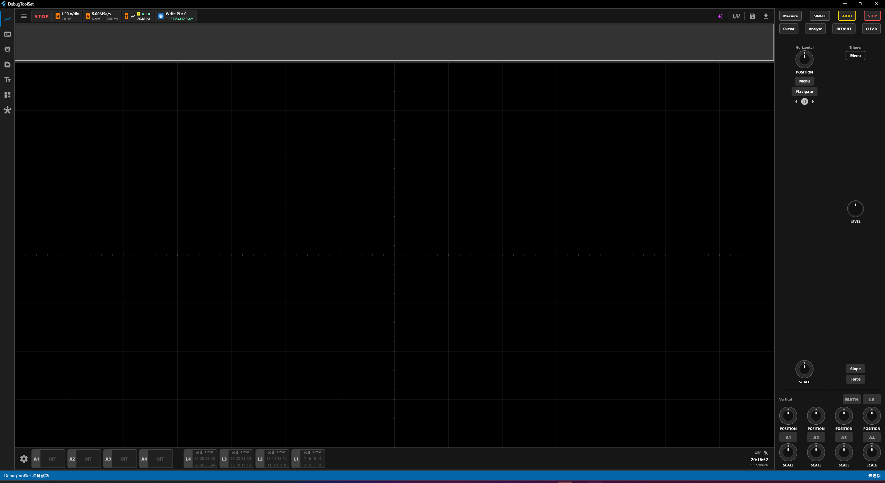
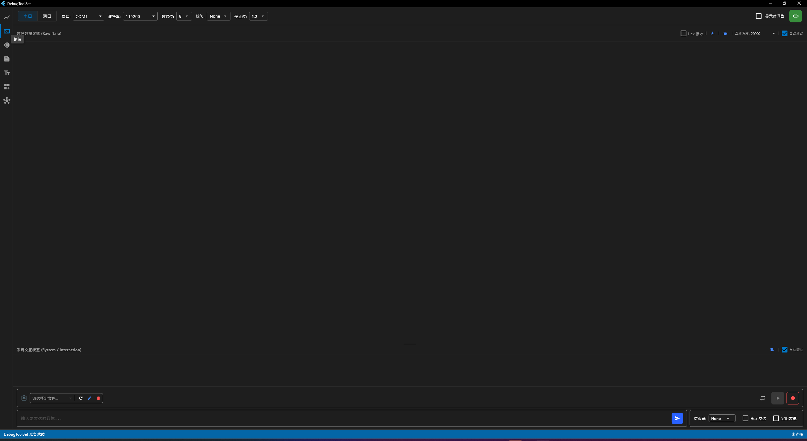
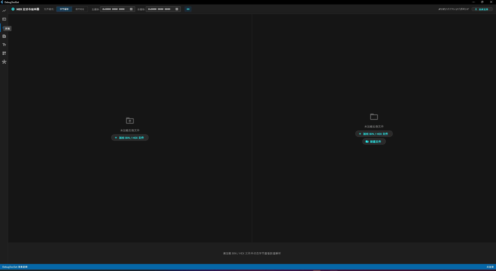
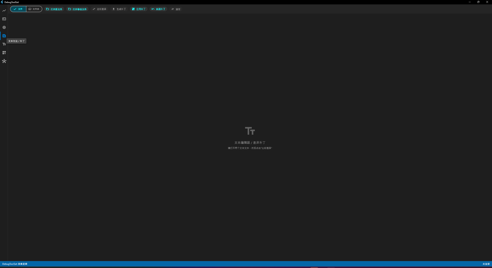
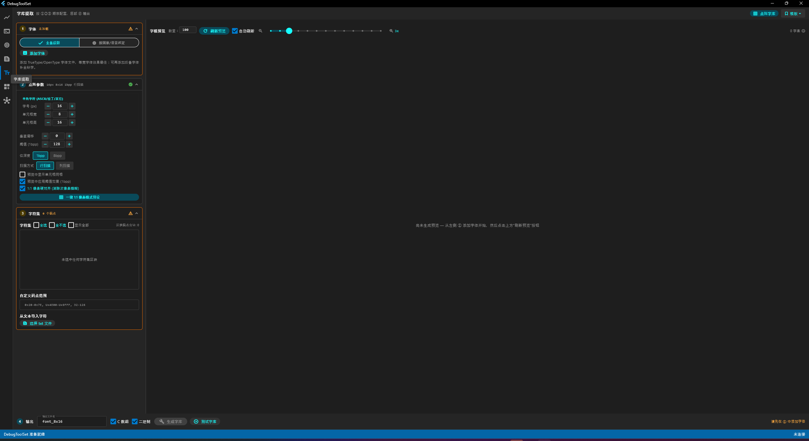
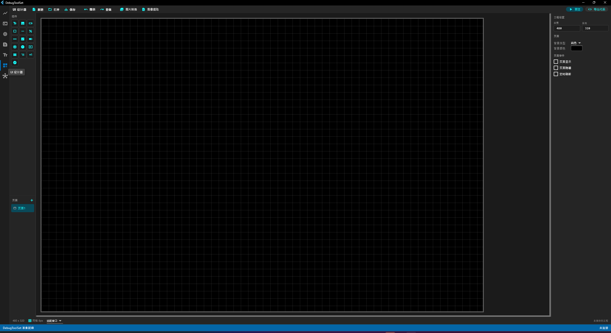
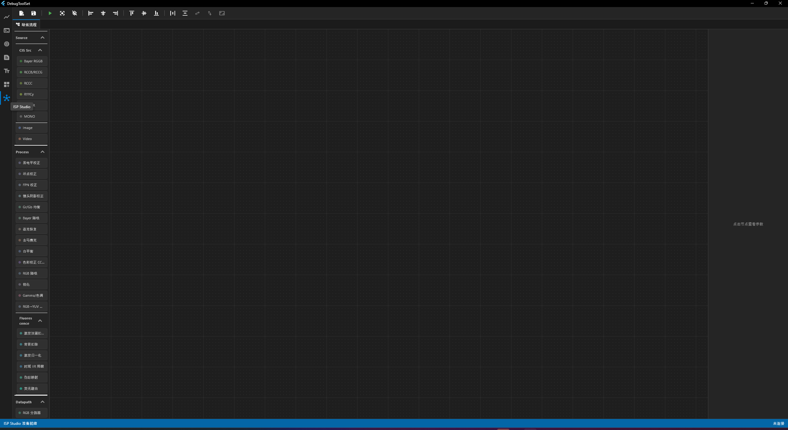

# DebugToolSet 使用手册

**DebugToolSet** 是一套面向嵌入式与硬件调试工程师的 Windows 桌面端多功能调试工具集。它把日常调试中最常用的七类工具整合在一个暗色主题的单窗口应用里：

1. **示波器** —— 4 路模拟通道 + 32bit 逻辑分析的混合信号示波器（MSO），支持 I2C/SPI/UART/CAN 等协议解码、总线搜索、寄存器/命令释义与波形存取；
2. **终端** —— 串口/网络数据终端，支持 ANSI 彩色日志、Hex 收发、定时发送与宏命令录制回放；
3. **Hex 编辑器** —— 双栏二进制比较与编辑，字节解析、Hex 计算器、多固件合并；
4. **文本对比/补丁** —— 文本文件与文件夹的逐行差异对比，生成/应用/回退 unified diff 补丁；
5. **字库提取** —— 把 TTF/OTF/TTC 字体转换为嵌入式点阵字库（C 数组 / 二进制），含字形预览与测试；
6. **UI 设计器** —— 嵌入式屏幕 UI 的拖拽设计、交互预览与 C99 代码导出；
7. **ISP Studio** —— 图像信号处理流水线的节点图编辑、预览调试与图像/视频导出。

应用启动后，左侧有一条窄边栏，点击图标即可在 7 个模块之间切换（顺序即上述 1–7）；界面整体为暗色主题。底部状态栏显示串口连接摘要等全局状态。

软件的安装与打包步骤请参阅 [安装指南](Installation_Guide.md)。

> **重要**：应用按**相对工作目录**访问多个数据目录（`waveform/`、`bussetup/`、`DeviceProtocol/`、`sequence/`、`IspFlow/`、`tools/ffmpeg/` 等）。绿色版运行时请从程序所在目录启动；安装版这些目录已随安装包放到程序同级。

## 目录

- [1. 示波器](#1-示波器)
  - [1.1 模块概述](#11-模块概述)
  - [1.2 界面布局](#12-界面布局)
  - [1.3 功能详解](#13-功能详解)
  - [1.4 典型操作流程](#14-典型操作流程)
  - [1.5 文件格式与数据目录](#15-文件格式与数据目录)
  - [1.6 注意事项与技巧](#16-注意事项与技巧)
- [2. 终端](#2-终端)
  - [2.1 模块概述](#21-模块概述)
  - [2.2 界面布局](#22-界面布局)
  - [2.3 功能详解](#23-功能详解)
  - [2.4 典型操作流程](#24-典型操作流程)
  - [2.5 文件格式与数据目录](#25-文件格式与数据目录)
  - [2.6 注意事项与技巧](#26-注意事项与技巧)
- [3. Hex 编辑器](#3-hex-编辑器)
  - [3.1 模块概述](#31-模块概述)
  - [3.2 界面布局](#32-界面布局)
  - [3.3 功能详解](#33-功能详解)
  - [3.4 典型操作流程](#34-典型操作流程)
  - [3.5 文件格式与数据目录](#35-文件格式与数据目录)
  - [3.6 注意事项与技巧](#36-注意事项与技巧)
- [4. 文本对比/补丁](#4-文本对比补丁)
  - [4.1 模块概述](#41-模块概述)
  - [4.2 界面布局](#42-界面布局)
  - [4.3 功能详解](#43-功能详解)
  - [4.4 典型操作流程](#44-典型操作流程)
  - [4.5 文件格式与数据目录](#45-文件格式与数据目录)
  - [4.6 注意事项与技巧](#46-注意事项与技巧)
- [5. 字库提取](#5-字库提取)
  - [5.1 模块概述](#51-模块概述)
  - [5.2 界面布局](#52-界面布局)
  - [5.3 功能详解](#53-功能详解)
  - [5.4 典型操作流程](#54-典型操作流程)
  - [5.5 文件格式与数据目录](#55-文件格式与数据目录)
  - [5.6 注意事项与技巧](#56-注意事项与技巧)
- [6. UI 设计器](#6-ui-设计器)
  - [6.1 模块概述](#61-模块概述)
  - [6.2 界面布局](#62-界面布局)
  - [6.3 功能详解](#63-功能详解)
  - [6.4 典型操作流程](#64-典型操作流程)
  - [6.5 文件格式与数据目录](#65-文件格式与数据目录)
  - [6.6 注意事项与技巧](#66-注意事项与技巧)
- [7. ISP Studio](#7-isp-studio)
  - [7.1 模块概述](#71-模块概述)
  - [7.2 界面布局](#72-界面布局)
  - [7.3 功能详解](#73-功能详解)
  - [7.4 典型操作流程](#74-典型操作流程)
  - [7.5 文件格式与数据目录](#75-文件格式与数据目录)
  - [7.6 注意事项与技巧](#76-注意事项与技巧)

---

## 1. 示波器



### 1.1 模块概述

示波器模块是一个**混合信号示波器（MSO）**界面，外观与操作对标台式示波器（RIGOL 风格），具备：

- **4 路模拟通道**（A1–A4，对应下位机 12-bit ADC，量程 ±10V）；
- **32 位数字逻辑分析通道**（D0–D31，分为 L1–L4 四个 8 位组，可配置阈值电压）；
- **软件协议解码**：I2C、SPI（含双线/四线 Quad SPI）、UART，以及 ADS7038H 专属 SPI ADC 分析器；触发层面还支持 CAN/LIN/USB 协议触发；
- **总线搜索**（按数值/地址/命令/字段在已采集数据中定位）、**事件列表**、**寄存器/命令释义**（挂载 `.Regfile` / `.UartProtocol` 文件后，解码帧可直接显示寄存器名、位域含义）；
- **波形存取**（`.waveform` 文件）与**总线配置存取**（`.bussetup` 文件）；
- **三种数据来源**：
  - 演示模式（内置模拟数据流，**默认开启**，无需任何硬件即可体验全部解码功能）；
  - 串口下位机（经「终端」模块建立连接，走二进制同步帧协议）；
  - LXI 网络仪器（SCPI 控制 + 可选连续波形流，内置 27 款 RIGOL 型号适配）。

每个通道的采样缓冲上限为 8M 点（8388608 点）。

### 1.2 界面布局

界面整体为「左侧显示区 + 右侧 320px 控制面板」，自上而下分为：

1. **顶部信息栏**：菜单、触发状态（绿色 `T'D` / 红色 `STOP`）、H 时基、A 采集、T 触发、内存写指针，右侧为演示模式 / LXI / 保存 / 加载按钮。
2. **迷你导航图**：整个缓冲区的波形缩略图，白色视口框指示当前显示位置，可点击或拖动定位；底部有 4px 进度条。
3. **逻辑分析工具栏**（仅在启用数字引脚或总线后出现）：缩放、导航、搜索、光标、触发设置等。
4. **主波形区**：波形画布；启用数字通道时顶部有时间刻度尺；底部可弹出寄存器释义面板；右侧可弹出事件列表面板。
5. **底部通道栏**：齿轮（通道快速设置）、A1–A4 通道盒、L4–L1 逻辑组盒、XCursor/YCursor 勾选框、系统状态盒（LXI/USB 连接图标 + 时钟）。
6. **右侧控制面板**：Measure / SINGLE / AUTO / RUN-STOP 按钮行，Cursor / Analyse / DEFAULT / CLEAR 按钮行，Horizontal（水平）区、Trigger（触发）区、Vertical（垂直）区（MATH/LA + 4 组通道旋钮）。

### 1.3 功能详解

#### 顶部信息栏

- **☰ 菜单**：
  - `分辨率设置`：Auto（默认）/ 1280*800 / 1366*768 / 1920*1080。选择非 Auto 时会调整整个应用窗口尺寸并居中，显示区按比例缩放。
  - `系统设置`、`关于`：目前为占位，无功能。
  - `仪器设置`：打开 LXI 连接对话框（见下文「LXI 联机」）。
- **触发状态块**：运行中显示绿色 `T'D`，暂停显示红色 `STOP`（初始为 STOP）。
- **H 时基块**：显示当前水平缩放 `{x} x/div`，点击弹出「时基设置 (Timebase)」对话框，滑块范围 0.1–10.0。
- **A 采集块 / T 触发块**：显示采集与触发概要，其中 `{triggerLevel} lvl` 为当前触发电平（ADC 值，默认 2048）。
- **内存块**：显示数字通道写指针与已用/总字节数。
- **演示模式按钮**（紫色 ✨）：开关内置模拟数据流，**默认开启**。演示模式开启时会忽略串口真实数据。
- **LXI 按钮**（绿色高亮表示已连接）：打开 LXI 对话框。
- **保存按钮**（蓝色 💾，tooltip「保存波形数据」）：弹「Save Waveform」对话框，默认文件名 `cap_<毫秒时间戳>.waveform`，自动补 `.waveform` 后缀，保存到 `waveform/` 目录。
- **加载按钮**（橙色 ⬇，tooltip「加载波形数据」）：列出 `waveform/` 目录下所有 `.waveform` 文件（含大小），点击即加载回放；加载期间自动暂停，加载失败恢复原状态。

#### 迷你导航图与主波形区

- **迷你导航图**：显示整个采样缓冲的波形缩略，白色视口框对应当前屏幕显示范围；单击或拖动可快速定位到任意位置；底部 4px 进度条指示缓冲填充程度。
- **时间刻度尺**：启用数字通道后出现在波形区顶部，按 1-2-5 步进自动选档，随水平缩放变化。
- **波形区手势**：滚轮水平滚动；`Ctrl+滚轮` 以鼠标位置为中心平滑缩放；左键拖动水平平移；右键拖框缩放到选区（小于 10px 的选框会被忽略）。
- **通道/引脚/总线指示器**（波形区左缘的彩色箭头）：竖直拖动改变该通道偏移；`Shift+滚轮` 改变其显示缩放（模拟通道 0.001–1000 连续，数字/总线 1.0–5.0 步进 0.5）；悬停时显示放大镜/展开图标提示。
- **双击操作**：模拟通道指示器→「重命名通道」；数字引脚指示器→「重命名逻辑通道」；普通总线指示器→散开/聚合切换；总线内引脚标签→「重命名总线引脚 (Dn)」；解码总线波形区→打开事件列表。
- **悬停协议包气泡**：Tooltip 显示该包的 Type/Data/Raw 明细。

#### 右侧控制面板

第一行按钮：

- **Measure**：暂无功能。
- **SINGLE**：单次触发——进入单次模式并 ARM 触发，触发并采满一屏后自动停止。
- **AUTO**（黄色）：自动设置——按可见通道数等分垂直空间、按数据峰峰值自动调整各通道垂直缩放/偏移，并把水平缩放调整到显示全部数据。
- **RUN/STOP**（绿/红）：开始/暂停采集。暂停时会触发一次全量协议解码。

第二行按钮：

- **Cursor**：开关 X/Y 测量光标（默认先开 X 光标）。开启后底部通道栏出现 XCursor / YCursor 勾选框，可分别开关。
- **Analyse**：暂无功能。
- **DEFAULT**：恢复默认——水平缩放 1.0、滚动归零、触发电平 2048、关光标、各通道垂直缩放 0.1、偏移 0。
- **CLEAR**：清空全部通道数据、清空搜索结果、关闭事件列表与释义面板，并重新解码。

**Horizontal（水平）区**：

- **SCALE 双旋钮**：调水平缩放（时基），范围 0.1–10.0；内圈粗调步进 0.05，外圈细调步进 0.0025。滚轮或竖直拖动均可操作。
- **POSITION 旋钮与 Menu / Navigate 按钮**：目前为占位，无功能。

**Trigger（触发）区**：

- **Menu**：打开「Trigger Menu」对话框：
  - `Mode`：AUTO（默认，持续采集滚动显示）/ NORMAL（等待触发条件满足后采满一屏，再自动重新 ARM）/ SINGLE（采满一屏后自动停止）；
  - `Source`：CH1–CH4 模拟触发源（默认 CH1）；
  - `Edge`：Rising（↑，默认）/ Falling（↓）/ Both（↕）。
- **LEVEL 旋钮**：触发电平 0–4095（默认 2048），每步 10。
- **Slope 按钮**：循环切换 上升沿 → 下降沿 → 双边沿。
- **Force 按钮**：等待触发时立即强制放行一屏（仅在等待触发状态下生效）。

**Vertical（垂直）区**：

- **MATH**：仅本地高亮切换，暂无运算功能。
- **LA**：无数字引脚时点击开启 D0–D7；已有引脚时点击关闭 D0–D31 全部。
- 每通道一列（A1–A4）：
  - **POSITION 双旋钮**：垂直偏移，范围 ±10000，内圈步进 10、外圈步进 1；
  - **A{n} 按钮**：切换通道显隐；开启时同时选为「当前通道」。按钮颜色即通道颜色：A1 黄、A2 青、A3 橙红、A4 绿；
  - **SCALE 双旋钮**：垂直缩放，范围 0.1–10.0，内圈 0.05 / 外圈 0.0025。

#### 逻辑分析工具栏

- **Zoom In / Zoom Out**：以屏幕中心缩放 ×1.2 / ÷1.2。
- **Zoom to Fit**：等同 AUTO。
- **Jump to Start / Jump to End**：跳到首/末采样点。
- **Rewind / Fast Forward**：按住连续滚动，松开停止。
- **Jump to Trigger**（T 形图标）：跳到触发点。
- **Search**（放大镜）：打开「搜索总线数据」对话框（见下文「总线搜索」）。
- 有搜索结果时：「上一个匹配（Shift+F3）」、计数 `n/N`、「下一个匹配（F3）」、「清除匹配（×）」。
- **Xcursors**：开光标；开启后出现：
  - 光标重置：X1 放到可视区 1/3 处、X2 放到 2/3 处；
  - 链接（Link Cursors）：拖动一根光标另一根随动（保持间距）；
  - 磁铁（Snap to Edge）：拖动 X 光标自动吸附最近的数字边沿或模拟过零点；
  - X1 / X2 按钮：光标在屏外时出现，点击将其居中。
- **Trigger Set**：打开「逻辑触发 (LA Trigger)」对话框（见下文「逻辑触发」）。
- 右侧状态：采样率显示（如 `500.0 kSa/s`）与触发状态描述。

#### 底部通道栏

- **齿轮图标**：打开「通道快速设置」大对话框：
  - 左列：`模拟通道 (Analog)` A1–A4 开关 + 总开关；`数字通道 (Digital)` 四组（D7–D0 / D15–D8 / D23–D16 / D31–D24，组色分别为蓝/绿/粉/橙），每组开关 + 每引脚独立开关；
  - 右列：`总线分组配置 (Buses)` 列表 + 底部四按钮：`添加总线`、`保存配置`、`导入配置`、`删除配置`；
  - 总线条目内联操作：色点改颜色、点名称重命名、`Pins: Da - Db` 改引脚范围、`批量命名引脚`、`事件列表/隐藏列表`、散开/聚合、格式下拉 HEX/DEC/BIN/ASCII、删除总线。
- **A1–A4 通道盒**：左侧色条点击开关通道；盒体点击打开「模拟通道 A{n} 配置」对话框：
  - `探头衰减`：1X / 10X（默认）/ 100X；
  - `探头阻抗`：1M（默认）/ 50Ω；
  - `耦合方式`：DC（默认）/ AC / GND；
  - 盒面实时显示：垂直档位 `{V}/div`、偏移电压、衰减倍数、耦合与阻抗。
- **L4–L1 逻辑组盒**：色条点击整组开关 8 个引脚；盒面显示 `阈值: {x}V`（默认 1.25V）与 8 个引脚号（绿色=启用）；盒体点击打开子通道配置对话框：
  - `阈值电压`：预设 0.6 / 0.75 / 0.9 / 1.25（默认）/ 1.65 / 2.5 V，或自定义（0.0–10.0V）；
  - 每引脚一行：启用开关 + 别名输入框（hint「未命名」，清空即删除别名）。
- **系统状态盒**：LXI 图标 + USB 图标（绿=终端已连接串口/灰=未连接）、当前时间与日期。

#### 添加/修改总线

在「通道快速设置」中点 `添加总线`，`总线类型` 五选：

- **普通总线**：`Start Pin (LSB)`（D0–D30）、`End Pin (MSB)`、`Format`：HEX（默认）/DEC/BIN/ASCII。把一组数字引脚聚合成一条数值总线显示。
- **UART 协议分析器**：`RX 引脚`、`TX 引脚`（均可 None）、`波特率`：Auto（自动检测）/9600/19200/38400/57600/115200（默认）等；`数据位` 5–9（默认 8）；`校验位` None（默认）/Even/Odd；`停止位` 1/2；`位序` LSB First（默认）/MSB First。
- **I2C 协议分析器**：`SCL 引脚`、`SDA 引脚`。
- **SPI 协议分析器**：`CS/SCLK/MOSI(IO0)/MISO(IO1)/IO2/IO3 引脚`（除 SCLK 外可 None；IO2/IO3 用于 Quad SPI）、`协议文件 (可选)`（来自 `DeviceProtocol/SPI/*.Regfile`）、`CPOL` 0/1、`CPHA` 0/1、`数据位` 4/8（默认）/16/24/32、`位序` MSB First（默认）/LSB First。
- **ADS7038H 专属分析器**：CS/SCLK/MOSI/MISO 四引脚；解码后会把提取的模拟量注入虚拟通道 CH4（命名 `V_AIN (ADS7038H)`，紫色，自动可见）。

挂解码器的总线会自动给引脚起别名（SCL/SDA、CS/SCLK/MOSI/MISO、TX/RX），自动启用相应引脚，并立即全量解码。总线名重名自动加 `_1` 后缀；总线颜色按添加顺序循环分配（青/粉/琥珀/浅绿/深紫/蓝绿）。

> 已知不一致：「添加总线」对话框的 UART 波特率列表含 1000000，而「修改总线」对话框对应位置是 921600，两处选项略有差异。

#### 逻辑触发（Trigger Set →「逻辑触发 (LA Trigger)」）

- **控制权 (Control)**：`逻辑触发 (Digital)`（默认）/ `示波器触发 (Ext OSC)`——选后者则触发交由模拟通道边沿触发控制。
- 四个页签：
  - **单通道 (Single)**：`通道`（D0–D31，带别名）、`边沿`（上升/下降/双边）。
  - **总线 (Bus)**：`快速配置总线`（从已有总线取引脚范围）、`高位通道 MSB`（默认 7）、`低位通道 LSB`（默认 0）、`大小端`（默认小端）、`触发模式` 单一数值（默认）/序列匹配、`目标值`（如 `0x55` 或空格分隔序列 `0xAA 0xBB`）、序列模式多一项 `容限延时 (Delays)`（各值之间允许的最大点数，空格分隔）。
  - **高级总线 (Adv. Bus)**：`总线协议` I2C（默认）/SPI/UART，按协议事件触发：
    - **I2C**：SCL（默认 D0）/SDA（默认 D1）引脚；`触发条件` Start（默认）/Stop/Restart/Nack/Address/Data/AddrData；Address/AddrData 条件下有 `设备地址`（默认 0x50）、`地址位数` 7bit（默认）/10bit、`读写方向` Any（默认）/Read/Write；Data/AddrData 条件下有 `匹配数据` 与 `数据索引`（任意/字节 0–7）；
    - **SPI**：CS（默认 D4）/SCK（D5）/MOSI（D6）/MISO（D7）引脚；`CS 极性` 低有效（默认）/高有效；`时钟采样边沿` 上升沿（默认）/下降沿；`触发条件` CsActive（默认）/CsInactive/MosiData/MisoData/BothData，对应 `MOSI匹配值`/`MISO匹配值`；
    - **UART**：RX（默认 D2）/TX（D3）引脚；`波特率`（默认 115200）；`数据位数` 5–9（默认 8）；`奇偶校验` None（默认）/Odd/Even；`触发条件` StartBit（默认）/StopBit/Data/Sequence/ParityError，对应 `匹配数据`。
  - **协议 (Protocol)**：`特定协议` CAN（默认）/LIN/USB：
    - **CAN**：引脚（默认 D8）、波特率（默认 250000）、条件 SOF（默认）/ID/Data/Type/EOF/Error；ID 条件有 `运算符` =（默认）/!=/>/< 与 `匹配帧ID`（默认 0x100）；Type 条件有 `帧类型` Data（默认）/Remote/Error/Overload；Data 条件有 `匹配数据` + `数据偏移`（默认 0）；
    - **LIN**：引脚（默认 D9）、波特率（默认 19200）、条件 Sync（默认）/ID/Data/ChecksumError；`帧ID` 默认 0x3C；
    - **USB**：D+（默认 D10）/D-（默认 D11）引脚、`传输速度` LowSpeed/FullSpeed（默认）、条件 SOP（默认）/EOP/Reset/PID/Token/Data；`PID值` 默认 0x2D（SETUP）、`设备地址` 默认 1、`端点` 默认 0。
- 底部公共项：
  - `触发位置 (Position)`：1–99% 滑块（默认 10%），决定触发点在屏幕中的位置；
  - `预触发 (Pre-trigger)` 勾选（默认关；开启后等待触发期间数据不丢弃）；
  - `采样率`：数值 1/2/2.5/4/5/10/20/25/40/50/100/200/250/400/500 × 单位 KHz/MHz（默认 500 KHz）；修改采样率会重新解码并下发硬件；
  - `深度`：32.0 kpts – 256.0 Mpts 共 14 档（默认 8.0 Mpts）。
- 所有改动即时生效并向硬件下发数字触发配置。

#### 总线搜索（工具栏放大镜 →「搜索总线数据」）

- `目标总线`：下拉列出全部总线（名称 + 类型）。
- `挂载解析器`：对挂了解码器的总线，可挂载协议释义文件——UART 列 `DeviceProtocol/Uart/*.UartProtocol`；SPI 列 `DeviceProtocol/SPI/*.Regfile`；I2C 列 `DeviceProtocol/I2C/*.Regfile`（选中即按设备地址挂载）。
- I2C 专属条件：`帧类型`（读或写/仅写/仅读）、`设备地址`（从解码结果枚举，单设备自动选中）、`寄存器地址`（带寄存器名别名，可不限）、`数据格式` Hex/Dec/Bin/ASCII、`数据内容`（空格分隔多字节，留空不限）。
- SPI 专属条件：`SPI指令`（从帧中枚举命令，带 Regfile 命令名）、`MISO数据`、帧类型 Any/MOSI/MISO。
- UART 条件：`通道` 不限/仅 TXD/仅 RXD、`格式`、`数值`；挂协议文件后还可按协议定义的字段（CMD 及 payload 字段）搜索。
- `标线颜色`：搜索匹配的高亮颜色（默认黄）。
- 点 `全局搜索 (Search All)` 执行，结果显示 `Found N matches.`；N>1 时用 F3 / Shift+F3 在匹配间跳转。搜索后波形自动定位到第一个匹配并高亮，挂有解码器的总线会自动打开事件列表。上次搜索配置会被记住。

#### 事件列表（Packet List）

- 右侧 420px 面板，在总线条目点「事件列表」或双击波形区解码总线位置打开，标题为「事件列表 - {总线名}」。
- 工具条：搜索框（匹配帧摘要或包数据）；眼睛图标按包类型显示/隐藏（UART 默认隐藏 START/PARITY/STOP；I2C 默认隐藏 ACK/NACK；SPI 默认隐藏 START/STOP）。
- 帧卡片：`Frame #N` + 摘要 + `N pkts`；配色——I2C 写/UART Rx 为青色，I2C 读/UART Tx 为黄色，错误红色，不完整 `(Incomplete)` 白色。
- 单击帧：波形跳到该帧并高亮；双击帧：展开/收起包列表；单击包：波形居中到该包；**双击 I2C 地址包**：弹出「挂载 0xNN 寄存器文件」对话框（列出地址匹配的 Regfile，选 None 卸载）。

#### 寄存器释义面板

- 波形区底部 240px，点击解码帧/包后自动出现。
- I2C：未挂载时显示 `No Regfile mounted for 0xNN... (Click to mount)`，点击即可挂载；EEPROM（24Cxx 类）显示内存转储表（Offset + hex + ASCII），`DUMP` 按钮可 `Save as *.bin` / `Save as *.hex`；普通器件显示寄存器名、访问属性与逐位域解码（值映射/布尔标志）；`Change/Unmount` 可更换或卸载挂载。
- UART（挂 .UartProtocol）：表格式解析 Header / CMD / 各 payload 字段（含值映射名称）。
- SPI（挂 .Regfile）：`SPI Command: 0xNN - {命令名}`、CMD/ADDR/DATA 逐字节表格 + 位域解码，长数据同样支持 DUMP 存 bin/hex。
- ADS7038H：显示 `ADS7038H Frame Details - Mode: {...}` 字段明细。

#### LXI 联机（顶栏菜单「仪器设置」或 LXI 按钮）

对话框标题「LXI CORE 2011 DEVICE 连接与控制」，两个页签：

- **页签 1 `连接与配置 (LXI Connect)`**：
  - `目标仪器型号`：27 款 RIGOL 型号下拉（MSO9000/MSO8000A（默认）/MSO8000/MSO7000/MSO5000E/MSO5000/MSO4000/MSO2000A/MSO1000/MHO98/MHO900/MHO5000/MHO2000/DS9000/DS8000R/DS80000/DS70000/DS6000/DS4000E/DS1000ZE/DS1000Z/DS1000E/DS1000D/DHO900/DHO800/DHO5000/DHO4000/DHO1000）；
  - `仪器 IP 地址`（默认 192.168.1.100）、`TCP 端口号`（默认 5025，SCPI 默认端口）；
  - `连续波形数据流模式` 开关（默认关；开启后把 socket 数据当二进制帧流解析，关闭则作为 SCPI 文本通道并自动发 `*IDN?`）；
  - `连接设备 (Connect)` / `断开连接 (Disconnect)`；连接超时 3 秒；连接后经 HTTP 抓取 LXI 识别信息（厂商/型号/序列号/LXI 版本）；
  - 右列 `自动搜索 (mDNS)`：扫描局域网内 LXI 设备约 3 秒，点设备条目自动回填 IP。
- **页签 2 `SCPI 指令终端 (SCPI Console)`**：日志区（绿 `->` 发、青 `<-` 收、红错误，上限 100 条）；宏按钮 `*IDN? 标识识别`、`*RST 系统复位`、`:RUN 启动采集`、`:STOP 停止采集`、`:SINGLE 单次触发`、`:WAV:DATA? 获取波形数据`；底部输入框回车或点发送按钮发指令。
- **本地 SCPI 解释器**：未连接真机也可在 SCPI 终端练习，支持的命令包括：
  - 通用：`*IDN?`、`*RST`、`*CLS`、`*OPC?`、`*OPC`；
  - 采集控制：`:RUN`、`:STOP`、`:SINGLE`、`:TFORCE`、`:AUTOSCALE`、`:CLEAR`；
  - 通道：`:CHANnel{1-4}:DISPlay / SCALe / OFFSet`（含查询）；
  - 时基与触发：`:TIMebase:MAIN:SCALe?`、`:TRIGger:SWEep?`（AUTO/NORMAL/SINGLE）、`:TRIGger:EDGE:SOURce / SLOPe / LEVel`（含查询）；
  - 波形：`:WAVeform:SOURce / DATA?`、`:CURV?`（注入 400 点模拟波形帧）；
  - 波特图：`:BODEPLOT:*`（使能/运行/起止频率；MHO/DHO/MSO5000 系新型号用 `:BODEPLOT:START/STOP`，MSO9000/DS9000 等老型号用 `:BODEPLOT:FREQUENCY:START/STOP`，其余型号报不支持）。
- LXI 连接时，界面上的操作（通道开关、时基、触发、探头、耦合等）会同步发送对应 SCPI 给仪器。

### 1.4 典型操作流程

#### 场景 A：演示模式下体验协议解码与搜索（开箱即用）

1. 打开示波器模块，演示模式默认已运行；初始为 STOP，点右面板 **RUN** 或 **AUTO** 开始滚动波形（CH1 1kHz 正弦 5Vpp、CH2 10kHz 正弦 10Vpp、CH3 22.4832kHz 方波 15% 占空、CH4 2kHz 方波 1Vpp）。
2. 点右面板 **LA**（或底部 L1 色条）启用 D0–D7；此时 D0/D1 上是 I2C 数据（TCA9548A→SN65DP159→24C16 页写序列），D2/D3 上是 115200 UART 数据（OAS-1000D100 自定义帧）。
3. 点底部齿轮 →「通道快速设置」→ `添加总线`：类型选 `I2C 协议分析器`，SCL=D0、SDA=D1，确定；再添加 UART 分析器 RX=D2、TX=D3、Auto 波特率。波形区随即出现解码行（地址/数据气泡、Tx/Rx 着色）。
4. 按 STOP；点工具栏放大镜：`目标总线` 选 I2C 总线，`挂载解析器` 选 `24C16.Regfile`，`设备地址` 选 0x50，`寄存器地址` 选任意片内地址，点 `全局搜索` → 用 F3/Shift+F3 在匹配间跳转。
5. 双击波形中的解码帧（或在事件列表中点帧）→ 底部弹出释义面板，查看 EEPROM 转储，可 `DUMP` 存 bin/hex。
6. 点顶部 💾 保存为 `waveform/cap_xxx.waveform`；之后 ⬇ 可随时回放。

#### 场景 B：串口下位机实时采集 + 数字触发

1. 先在「终端」模块连接下位机串口（连接成功瞬间示波器自动把采样率/触发配置同步下发给硬件）。
2. 回示波器，顶栏关掉演示模式；点 RUN。
3. 底部 L1–L4 盒启用对应引脚组，点盒体设阈值（如 1.25V）并给引脚命名。
4. 工具栏 `Trigger Set`：控制权保持「逻辑触发」，选「总线」页签——MSB/LSB 选引脚、`序列匹配`、目标值 `0xAA 0xBB`、容限延时如 `100`；触发位置拖到 20%，勾选预触发；在 Trigger Menu 里把 Mode 设为 NORMAL。
5. 点 RUN，波形在总线出现目标序列时锁定一屏；Normal 模式采满后自动重新 ARM。
6. 用光标（Cursor + 磁铁吸附）量 ΔT，或用 X1/X2 链接模式整体平移测量区间。

#### 场景 C：LXI/SCPI 远程联机

1. 顶栏菜单 → `仪器设置`（或点 LXI 图标）→ 选目标型号（如 RIGOL MSO8000A），输入 IP/端口 5025；也可点右侧刷新做 mDNS 自动搜索。
2. 需要波形流时打开「连续波形数据流模式」再连接；否则保持关闭，作为 SCPI 控制通道。
3. 连接成功后面板所有操作（通道开关、时基、触发电平/边沿、探头/耦合）都会实时发 SCPI 给仪器。
4. 切到 `SCPI 指令终端` 页签，用宏按钮或手输命令调试；未连真机时 `:WAV:DATA?` 会注入一屏测试波形。

### 1.5 文件格式与数据目录

以下目录均按**相对工作目录**访问：

| 目录/文件 | 用途 |
|---|---|
| `waveform/*.waveform` | 波形存档。头部魔数 `WAVEFORM1.0` + JSON 元数据（缩放、触发电平、采样率、通道配置、数字引脚与总线配置等）+ gzip 压缩的原始采样数据。保存/加载对话框内置于顶栏 |
| `bussetup/*.bussetup` | 总线配置，单行 JSON（版本号、水平缩放/偏移、总线列表）。仓库自带 Gray_Count8、Gray_HEX、I2C_HEX、I2C_PROTOCOL、Uart_hex、W25Q64 六个示例。保存时重名需确认覆盖；导入时可选择「追加 / 清除并覆盖 / 保存原有并覆盖」 |
| `DeviceProtocol/I2C/*.Regfile`、`DeviceProtocol/SPI/*.Regfile` | JSON 寄存器/命令定义（寄存器地址、位域、值映射、命令表等）。自带 24C01_02/24C04/24C08/24C16/SN65DP159/TCA9548A（I2C）、ADS7038H/W25Q64JW（SPI）。格式规范见 [Regfile 格式说明](Regfile_Format.md) |
| `DeviceProtocol/Uart/*.UartProtocol` | JSON UART 帧格式定义（帧头、命令字、payload 字段、值映射）。自带 OAS-1000D100。规范见 `docs/UartProtocol_Format.md` |
| `docs/Oscilloscope_Protocol.md` | 下位机二进制帧通信协议规范（供固件开发者参考） |

### 1.6 注意事项与技巧

**快捷键与鼠标**：

- `F3` / `Shift+F3`：下一个/上一个搜索匹配（全局生效）。
- 波形区缩放/平移/框选、指示器拖动、双击重命名等鼠标操作详见 1.3「迷你导航图与主波形区」。

**行为与限制**：

- 演示模式开启时忽略串口真实数据；暂停时停止接收（串口/LXI 流数据在暂停时不入缓冲）。
- 协议解码为软件事后解码：在暂停、改采样率、总线/解码器配置变更时全量重跑；采样率必须大于 0 才能解码。
- Normal/Single 触发模式在触发满足前丢弃数据（除非开预触发）；采满一屏后 Single 停、Normal 重新 ARM。
- 串口采集必须先在终端模块连好串口——示波器与终端共用同一条串口连接。
- 目前为占位无实现的功能：「Measure」「Analyse」「Add Decoder」按钮、Horizontal POSITION 旋钮、Horizontal Menu/Navigate 按钮、顶部「系统设置」「关于」菜单；MATH 按钮仅本地高亮。
- 单通道 8M 点缓冲 × 5 通道，内存占用约 160MB 起步，属设计预期。

---

## 2. 终端



### 2.1 模块概述

终端模块是**串口 / 网络数据终端**，用于与嵌入式设备进行原始字节级交互：

- 打开本机串口，收发原始数据（ASCII / Hex）；
- 接收区支持 ANSI/VT100 转义序列渲染（彩色日志）、日志关键字高亮、Hex 显示、相对时间戳；
- 发送区支持 ASCII / Hex 发送、结束符追加、定时发送、命令历史；
- 内置**宏命令系统**：把手动发送过程录制为 `.sequence` 脚本文件，可回放、循环回放、编辑；
- 收到的原始字节同时分发给示波器模块做协议解码——**示波器与终端共用同一条串口连接**，示波器联机时应在本模块建立串口连接。

### 2.2 界面布局

整体为纵向布局，从上到下四个区域：

1. **顶部连接配置面板**：「串口/网口」模式切换、端口参数（端口、波特率、数据位、校验、停止位或 IP/Port）、「显示时间戳」复选框、连接按钮；
2. **上屏：纯净数据终端 (Raw Data)**：设备原始数据接收区，带 Hex 接收、另存为文件、清除输出、回滚深度、自动滚动控件；
3. **下屏：系统交互状态 (System / Interaction)**：系统消息区（连接/断开/错误/宏播放日志）。与上屏之间有一条**可上下拖拽的分割线**，可调整两屏高度；
4. **底部发送区**：第一行为宏工具栏（宏文件选择、刷新、编辑、删除、循环、播放、录制），第二行为发送输入框 + 结束符 / Hex 发送 / 定时发送设置。

### 2.3 功能详解

#### 顶部连接配置面板

| 控件 | 说明 |
|---|---|
| 「串口 / 网口」切换 | 连接模式选择，**已连接时不可切换**，默认「串口」 |
| 端口 | 文本框 + 下拉箭头。下拉列表点击时实时枚举本机串口，无端口时显示「无可用端口」，也可手动输入端口名。默认 `COM1` |
| 波特率 | 文本框（可输入任意整数）+ 下拉常用值：9600 / 19200 / 38400 / 57600 / 115200 / 921600。默认 `115200` |
| 数据位 | 下拉：5 / 6 / 7 / 8。默认 `8` |
| 校验 | 下拉：None / Odd / Even / Mark / Space。默认 `None` |
| 停止位 | 下拉：1.0 / 1.5 / 2.0。默认 `1.0` |
| IP / Port（网口模式） | 默认 `192.168.1.100` : `8080`。**注意：网口模式目前为 Mock 实现，功能开发中**，连接后不会真正建立 TCP 连接 |
| 显示时间戳 | 复选框，默认关。开启后上屏每行前显示**相对连接时刻**的时间差，格式 `DD:HH:MM:SS.mmm`（灰色），仅上屏有效 |
| 连接按钮 | 圆形图标按钮：未连接为绿色链接图标，已连接为红色断开图标。连接后所有端口参数控件锁定 |

连接成功后下屏输出绿色消息 `[SYSTEM] Connected to COM1 (115200, 8N1.0)`（参数缩写为 数据位+校验首字母+停止位）。打开失败、设备拔出等输出红色错误消息；串口物理断开会自动断开并提示「串口已物理断开」。

#### 上屏「纯净数据终端 (Raw Data)」

| 控件 | 说明 |
|---|---|
| Hex 接收 | 复选框，默认关。开启后接收数据按 `XX ` 大写十六进制显示，以字节 `0x0A` 分行。关闭时按文本显示：`\n` 换行、`\r` 忽略、`\b` 退格删除前一字符、`\t` 转 4 空格 |
| 另存为文件 | 把当前上屏全部行保存为文本文件（类型过滤 txt / log，建议文件名 `terminal_log_<毫秒时间戳>.txt`）。**注意保存的是渲染后的文本，不是原始字节** |
| 清除输出 | 清空上屏 |
| 回滚深度 | 下拉：2000 / 5000 / 10000 / 20000 / 50000 / 100000 / 200000 行，默认 `20000`。调小深度时立即裁剪已有日志 |
| 自动滚动 | 复选框，默认开。有新数据时自动滚到底部 |

其他行为：输出区字体 Consolas，文本可用鼠标选择复制。

**ANSI 彩色日志**：支持标准 SGR 颜色（前景 30–37、背景 40–47 及对应亮色）、粗体、斜体、下划线等；非颜色类转义序列（光标移动等）被过滤隐藏。另有**日志关键字高亮**：`ERROR/FAIL/FAILED/FATAL/PANIC` 红色、`WARNING/WARN` 黄色、`INFO/SUCCESS/OK` 绿色，IPv4 地址、`/dev/xxx` 设备路径、MAC 地址为青色。

#### 下屏「系统交互状态 (System / Interaction)」

- 只显示系统消息，每条自动加灰色序号前缀 `[0001]`～`[9999]`（到 9999 后回到 0001）；
- 容量固定 2000 行，超出裁掉最旧的；
- 头部只有「清除输出」按钮，没有另存、回滚深度、时间戳；
- 消息带颜色：绿色=连接成功/宏播放完毕，红色=错误/断开，黄色=警告/中止，灰色=附加错误详情。

#### 宏工具栏（发送区第一行）

左半区（文件管理）：

- **宏文件下拉框**：列出 `sequence/` 目录下全部 `.sequence` 文件，hint「请选择宏文件...」；
- **刷新列表**：重新扫描 `sequence/` 目录；
- **编辑脚本**（蓝色铅笔图标）：打开宏编辑器对话框；
- **删除脚本**（红色垃圾桶图标）：弹确认框「您确定要删除宏 "xxx" 吗？此操作不可恢复。」。

右半区（播放控制）：

- **循环开关**：开启循环播放，开启后左侧出现参数面板：
  - **间隔**：两轮循环之间的等待毫秒数，默认 `1000` ms；
  - **次数**：循环次数，默认 `0` = 无限循环（显示「(无限)」）；
- **播放按钮**（绿色 ▶）：播放选中的宏文件；播放中变为红色 ■，可手动中止；
- **录制按钮**（红色圆点）：开始录制，之后手动发送的每条命令及其间隔都会被记录；录制中变为红色保存图标（带已录条数角标），点击弹出「保存宏序列」对话框：输入文件名（**不含后缀**，自动补 `.sequence`），按钮「保存」/「放弃录制」。

互斥规则：录制中不能播放、播放中不能录制；播放或录制期间，文件下拉、刷新、编辑、删除、循环开关均禁用。

#### 发送输入行（发送区第二行）

- **输入框**：hint「输入要发送的数据...」。ASCII 模式下拒绝非 ASCII 字符；Hex 模式下自动大写、只保留 `0-9 A-F` 和空格，并按两个字符一组自动分字节、自动补零；
- **发送按钮**（蓝色纸飞机）：回车同样发送。未连接时下屏提示黄色「[Warning] 请先连接设备。」。发送后 ASCII 模式在接收区回显青色 `> 命令`，Hex 模式回显 `> [HEX] XX XX`；
- **结束符下拉**：`None / CR / LF / CRLF`，默认 `None`。CRLF=追加 `0D 0A`，CR=`0D`，LF=`0A`。Hex 模式下此下拉禁用；
- **Hex 发送**复选框：切换时会把当前输入框内容存入旧模式历史，并载入新模式历史的最近一条命令；
- **定时发送**复选框：勾选后出现间隔输入框（默认 `1000` ms）。此时点发送按钮**启动**周期定时器（按钮变红色停止图标），再次点击停止；设备断开后定时器自动停止并提示；
- **命令历史**：输入框内按 ↑/↓ 翻阅历史命令，ASCII 与 Hex 各自维护独立历史；连续重复命令不重复入栈。

#### 宏编辑器对话框

- 标题「编辑宏序列: <文件名>」；
- 每条指令一张卡片，字段：序号、「发送指令」文本框、「结束符」下拉（None/CR/LF/CRLF）、Hex 复选框、「延迟(ms)」输入框（该条指令**执行前**的等待时间）；
- 每条可「上移」「下移」「删除此条」；底部「添加新指令」（新指令默认结束符 CRLF、延迟 1000ms）；
- 「取消」/「保存」，保存后提示「宏序列已更新」。

### 2.4 典型操作流程

#### 场景一：串口收发调试（基础）

1. 顶部确认模式为「串口」；点「端口」下拉选择实际端口（如 COM3），或手动输入；
2. 设置波特率（下拉选 115200 或手动输入任意值）、数据位 8、校验 None、停止位 1.0；
3. 点右侧绿色「连接」按钮，下屏出现绿色 `[SYSTEM] Connected to COM3 (115200, 8N1.0)`；
4. 底部输入框输入命令（如 `AT`），结束符选 CRLF，回车发送；设备回复显示在上屏；
5. 若回复是二进制，勾选「Hex 接收」查看十六进制；需要留档时点「另存为文件」保存日志；
6. 调试完点红色「断开」按钮。

#### 场景二：录制并循环回放初始化宏

1. 先连接设备；
2. 点宏工具栏红色「录制宏」按钮；
3. 依次手动发送初始化命令（正常用输入框发送即可，**命令间的实际时间间隔会被自动记录**为该条指令的延迟）；
4. 点红色保存按钮，输入文件名（如 `init_screen`），保存为 `sequence/init_screen.sequence`；
5. 需要重复压测时：开启循环开关，设置「间隔: 1000 ms」「次数: 0（无限）」，点绿色播放按钮；下屏显示「开始播放宏: init_screen.sequence （循环 无限 次）」；
6. 随时点红色停止按钮中止；设备中途断开会自动中止并提示。

#### 场景三：Hex 定时轮询

1. 连接设备后勾选「Hex 发送」，输入框输入 `01 03 00 00 00 02`（格式化器会自动分组补零）；
2. 勾选「定时发送」，间隔设为 `500` ms；
3. 点发送按钮启动轮询（按钮变红色停止图标）；接收区可持续观察应答；
4. 再点一次停止；若设备掉线，轮询自动停止并在下屏提示。

### 2.5 文件格式与数据目录

- **`sequence/` 目录**（相对工作目录，程序运行时自动创建）：存放宏脚本，扩展名 `.sequence`，内容为 JSON 数组，每个元素形如：

```json
{"command": "AT", "isHex": false, "eolMode": "CRLF", "delayMs": 500}
```

  - `delayMs` 是该步**执行前**的延迟，录制时取相邻两次手动发送的真实时间差；
  - 文件可手工编辑后放入 `sequence/` 目录，点「刷新列表」即可使用。
- **日志导出**：上屏内容可另存为 `.txt` / `.log` 纯文本。

### 2.6 注意事项与技巧

- **与示波器共享串口数据**：终端收到的原始字节会广播给示波器模块做协议解码，示波器联机采集必须先在终端模块连好串口。
- **网口模式未实现**：当前为 Mock，连接不会真正建立 TCP 会话。
- **快捷键**：发送输入框内 `Enter` = 发送；`↑`/`↓` = 翻阅命令历史（ASCII/Hex 历史独立）。
- 发送仅支持 ASCII（非 ASCII 字符被过滤器拒绝），中文等多字节字符无法从输入框发送。
- Hex 发送解析时奇数个十六进制字符会在末尾补 0（如 `A B C` → `0A 0B C0`）。
- 时间戳是相对连接时刻的偏移，不是绝对时钟；断开重连后基准重置。
- 回滚深度只影响上屏；下屏固定 2000 行上限。
- 连接状态下所有连接参数均被锁定，需先断开才能修改。
- 应用底部状态栏全局显示当前连接摘要：已连接时显示 `<端口> - <波特率>`，未连接显示「未连接」。
- 宏播放期间切换模块不会中断播放，但手动断开连接会中止。
- 串口被物理拔出或读写出错时自动断开并在下屏提示；宏播放、定时发送都会在断开后自动中止。

---

## 3. Hex 编辑器



### 3.1 模块概述

Hex 编辑器（界面标题「HEX 比较与编辑器」）是一个面向固件开发的双栏二进制工具，集四大功能于一体：

- **双文件差异比较**：左右各加载一个 BIN/HEX 文件，按「字节偏移」或「绝对地址」两种模式逐字节比对，差异字节红色高亮，工具栏实时显示差异总数；
- **二进制查看与编辑**：16 字节/行的 HEX + ASCII 视图，支持进入编辑模式直接用键盘改写任意字节，确认后覆盖写回原文件（HEX 文件自动重编码为 Intel HEX）；
- **字节解析面板**：点击任意字节，底部面板将其解析为 8/16/32 位有/无符号整数（大端/小端）、二进制、ASCII；
- **多固件合并**：把多个 BIN/HEX 文件按指定目标地址拼合成一个固件映像，间隙自动填充，可导出 BIN 或 Intel HEX，支持合并清单（JSON）的保存/加载。

### 3.2 界面布局

自上而下：

1. **主工具栏**：模块图标 + 标题「HEX 比较与编辑器」、对齐模式切换、左/右偏移输入框（含计算器按钮）、同步滚动开关、差异统计徽章、「合并文件」按钮；
2. **中部左右双栏**：两个结构完全对称的十六进制面板，每栏有自己的子工具栏（文件路径、起始地址/大小、编辑/保存等操作按钮）、表头（Address / 00–0F / ASCII）、可滚动 HEX 数据区、右侧 21px 宽的差异迷你地图（含「上一个差异 ▲」「下一个差异 ▼」按钮）；
3. **底部字节解析面板**：左右两列分别显示左/右栏当前选中字节的数值解析；未加载任何文件时显示提示「请加载 BIN / HEX 文件并点击字节查看数值解析」；
4. **全屏遮罩**：执行差异比较时弹出「正在执行文件比较」进度条。

未加载文件的空栏显示占位：左栏「未加载左侧文件」+「加载 BIN / HEX 文件」按钮；右栏多一个「新建文件」按钮。

### 3.3 功能详解

#### 主工具栏

| 控件 | 说明 |
|---|---|
| **对齐模式**：`字节偏移` / `绝对地址` | 默认「字节偏移」。字节偏移模式按「文件内偏移（扣除各自偏移量后）」逐字节对齐比较；绝对地址模式按 Intel HEX 记录的真实绝对地址对齐（含稀疏段空洞，缺数据一侧算差异）。切换后立即重新计算差异 |
| **左偏移 / 右偏移** | 仅字节偏移模式可见。12 位十六进制定长输入框，格式 `0xXXXX XXXX XXXX`，覆盖式输入（打字替换光标处字符），取值范围 0x0 ~ 0xFFFF FFFF FFFF，默认 `0x0`。回车提交 |
| **偏移框内计算器图标** | tooltip「十六进制计算器」，弹出 Hex 计算器，初始值取当前偏移框内容；「确认」后把结果写回偏移并重新比较 |
| **同步滚动开关**（链条图标） | 默认开启。开启时两栏滚动位置、点击选中的字节、选区都会按对齐模式换算后联动 |
| **差异徽章** | 两文件都加载后显示：有差异时红色「检测到 N 处差异」，无差异时绿色「两文件内容完全一致」 |
| **合并文件** | 打开多固件合并对话框 |

#### 每栏子工具栏（文件加载后）

- **文件信息**：第一行完整文件路径，第二行「起始地址： 0xXXXXXXXX | 大小： N 字节」（BIN 起始地址为 0x0；HEX 取其最小记录地址）。
- **手动输入选区**（edit_note 图标）：弹「手动选择选区」对话框，含「起始地址」「结束地址」两个十六进制输入框；输入越界自动钳位、起止颠倒自动交换。该对话框设置的选区**不做左右联动**，用于两侧选不同大小区域做覆盖。
- **清除选择**（× 图标）：清除本侧选区（同步滚动开启时两侧一起清）。
- **选区信息**：`选区: 0x… - 0x… (NB)`。
- **导出选区**（上传图标）：tooltip「选择导出格式并保存选区」，弹出菜单三项：
  - 「导出为 BIN 文件 (*.bin)」
  - 「导出为 Intel HEX 文件 (*.hex)」
  - 「导出为 C/C++ 头文件 (*.h)」
  默认文件名 `<原名>_Crop_S0x<起始地址>_L<长度>.<扩展名>`。C 头文件生成带 include guard 的 `const unsigned char` 数组及 `_LEN` 宏（16 字节/行）。
- **覆盖箭头**（红色 → 或 ←）：仅当两侧都有选区时出现。行为：**先删除目标侧选区，再把源侧选区字节插入该位置**，目标长度随源选区变化（不是等长替换），属于结构性修改。
- **编辑模式开关**（铅笔图标）：tooltip「进入编辑模式：直接修改 HEX 字节 / 退出编辑模式 (Esc)」。进入后起始编辑地址 = 当前选中字节。
- **丢弃修改**（绿色 undo 图标，仅有未保存修改时出现）：单字节修改清内存编辑表；结构性修改从磁盘重新加载原文件。
- **保存**（红色软盘图标，仅有未保存修改时出现）：先弹「覆盖确认」对话框（「确定要保存并覆盖原文件吗？」，按钮「取消/覆盖」），确认后写盘：BIN 直接覆写字节，HEX 重新编码为 Intel HEX，成功后自动重新加载。
- **关闭文件**（红色 × 图标）：卸载该侧文件并清空其编辑与选区。

#### HEX 数据区

- 表头三列：`Address` | `00 01 … 07  08 … 0F`（第 7、8 列间加宽间隔） | `ASCII`。
- 每行 16 字节；地址列显示 48bit 地址 `0xXXXX XXXX XXXX`（青色）。
- 字节语义着色：`0x00` 灰色、`0xFF` 琥珀色、可打印 ASCII（0x20–0x7E）绿色、其余白色；**差异字节红底红字加粗**；**已修改字节琥珀色 + 黄框**；正在编辑的单元格橙底橙框；选中字节青色边框；选区蓝底；稀疏/越界空洞显示 `--`，若对侧此处有数据则以淡红底标出「缺失」。
- ASCII 列同步着色，不可打印字符显示 `.`。

#### 合并文件对话框（「合并多个 BIN / HEX 文件」）

- **「添加文件」**：打开文件选择器（过滤器 `*.bin, *.dat` 与 `*.hex`）。首个文件默认目标地址取其自身基地址（HEX 为最小记录地址，BIN 为 0）；**后续文件自动追加在上一个文件末尾**。
- **「加载清单」/「保存清单」**：JSON 格式合并清单。加载时不存在的文件会跳过并提示。
- **清单每行**：序号、类型图标、文件名、「大小： N 字节」、「目标地址」编辑框、「长度」只读框、上移/下移/删除按钮。
  - 目标地址框：格式 `0xXXXX,XXXX,XXXX`（逗号分组），覆盖式输入。修改时**级联更新**：若后续文件的目标地址小于本文件末尾，自动顶到本文件末尾（只向下挤、不向上收）；提交时若小于最小合法地址会自动钳位并提示「目标地址过小，已自动调整为最小目标地址 …」；
  - **复位目标地址**：把本行目标地址重置为最小合法值，不影响后续行；
  - **计算器图标**：在对话框右侧内嵌展开 Hex 计算器（初值为该行目标地址），确认后写回并级联。
- **内存映像映射图 (Memory Map Preview)**：按比例绘制各文件块与红色「间隙」块，悬停显示每块「文件名 / 起止地址 / N 字节」。右上角显示「范围： 0x0 - 0x… （总字节数B)」。
- **填充字节**：默认 `0xFF`，支持十六进制（`0x` 前缀）或十进制输入。
- **默认导出格式**：`BIN` / `HEX` 切换（默认 BIN），仅决定保存对话框的默认文件名（`merged_firmware.bin` / `merged_firmware.hex`）；**实际输出格式由保存时输入的扩展名决定**。
- **「开始合并并保存」**：合并规则：各文件字节按其目标地址平铺到同一地址空间，**后添加的文件覆盖先添加文件的重叠区域**，空洞填填充字节。

#### Hex 计算器

- 48bit（12 位十六进制）仿实体计算器，宽 400px。显示区两行：操作数 A、运算符 + 操作数 B；点击任一行可将其激活为输入目标。
- 输入方式：点击按键，或物理键盘直接输入 `0-9 A-F`（左移滚动式进入最低位）、`+ - * /`、退格、回车（等于）。
- 按键布局：第 1 行 `CE ROL ROR AND OR NOT`；第 2 行 `⌫ SHL SHR NAND NOR XOR`；左侧 4×4 数字区（`9 8 7 F / 4 5 6 E / 1 2 3 D / 0 A B C`）；右侧 `+ -`、`* /`、宽条 `=`、底部「取消」「确认」。
- 运算集合：`+ - * /`（除零得 0）、`MOD`、`AND NAND OR NOR XOR NOT`（NOT 为一元）、`SHL SHR`（逻辑移位，位数对 48 取模）、`ROL ROR`（48bit 循环移位）。所有结果按 48bit 截断。
- 「=」只把结果写入 A，保留运算符和 B，可连续运算；「确认」把 A 作为结果返回调用方（偏移框或合并目标地址）。

#### 新建内存文件（右栏）

右栏空态的「新建文件」按钮创建一个**纯内存文件**（内部名 `新建文件.bin`），用于快速生成一块填充数据或作为覆盖操作的源。新建对话框参数：「文件长度」（十六进制，默认 `100`，最多 8 位）、「填充值」（默认 `00`）。注意：

- 右侧为新建内存文件期间**暂停差异比较**；
- 它没有磁盘路径，只能通过「导出选区」落盘；保存按钮对纯内存文件无磁盘目标。

#### 字节解析面板（底部）

选中字节后每列显示：标题「左/右侧数值解析 （文件名）」、「地址： 0xXXXXXXXX （偏移： 0xXXXXXXXX)」，以及 5 行解析表：

| 行 | 内容 |
|---|---|
| 8位数据 | 16进制 0xXX、二进制 `xxxx xxxx`、ASCII、Int8、Uint8 |
| 16位小端（LE) | 16进制 0xXXXX、Int16、Uint16 |
| 16位大端（BE) | 同上 |
| 32位小端（LE) | 16进制 0xXXXXXXXX、Int32、Uint32 |
| 32位大端（BE) | 同上 |

多字节解析从选中地址连续取 2/4 字节；越过文件末尾或落在 HEX 空洞处的字节按 0 处理。

### 3.4 典型操作流程

#### 场景一：对比两版固件的差异

1. 左栏点「加载 BIN / HEX 文件」选旧版 `BOOT.bin`，右栏同样加载新版 `BOOT.bin`。
2. 工具栏自动显示「检测到 N 处差异」；差异字节在两侧以红色标出。
3. 用右缘迷你地图上的 ▲/▼（「上一个差异/下一个差异」）在差异行之间跳转，或直接点击/拖动迷你地图红色刻度定位。
4. 若两文件实际内容相同但起始地址不同（例如一个带 0x100 字节的头），在「左偏移」输入 `0x100`（或点计算器图标计算后确认），差异立即按新偏移重算。
5. 若比较的是两个 Intel HEX（带绝对地址），切到「绝对地址」对齐模式，按真实地址比较，一侧缺失的区域会显示 `--` 并标为差异。

#### 场景二：修补固件中的一个字节并保存

1. 加载目标文件，点击要修改的字节（底部解析面板同步显示当前值的各种解释，便于确认）。
2. 点子工具栏铅笔图标进入编辑模式，当前字节出现橙色编辑框。
3. 键入两个十六进制数字（如 `3`、`F`），输入第一位时单元格显示 `3_`，第二位输入后立即生效并自动右移到下一字节；可用方向键/Tab 移动，Esc 退出编辑。
4. 改完点红色软盘图标，弹「覆盖确认」→ 点「覆盖」，文件写盘并自动重载（HEX 文件会以 Intel HEX 格式重写）。反悔可在保存前点绿色 undo「丢弃修改」。

#### 场景三：合并多个 BIN 为一个 Flash 映像

1. 点工具栏「合并文件」→「添加文件」依次加入各分区 BIN；每加一个，目标地址自动接到前一个末尾。
2. 需要留空洞时，直接把某行「目标地址」改大（后续行若被压住会自动级联下挤）；内存映像图上可直观看到红色「间隙」块。
3. 确认「填充字节」为 `0xFF`，导出格式选 BIN，点「开始合并并保存」，选择输出路径。
4. 下次复用同一布局：点「保存清单」存为 `merge_list.json`，之后「加载清单」一键恢复（仓库内有真实样例 `binfile/merge_list.json`）。

#### 场景四：从固件中裁剪一段交给嵌入式代码

1. 加载文件，拖动（或 Shift+点击，或「手动输入选区」）选中目标区域。
2. 点导出图标 →「导出为 C/C++ 头文件 (*.h)」，得到带起始地址/长度注释和 `_LEN` 宏的 C 数组（数组名形如 `xxx_S0x200_L512`）。

### 3.5 文件格式与数据目录

- **输入**：`*.bin` / `*.dat`（按连续字节读入，基地址固定 0）；`*.hex`（Intel HEX，支持 00 数据、01 EOF、02 扩展段地址、04 扩展线性地址记录；逐行校验长度与 Checksum，格式错误会给出带行号的中文错误信息）。
- **选区导出**：`.bin`、`.hex`（每行 16 字节数据记录）、`.h`（C 头文件数组）。
- **合并清单 JSON**（`version: 1`）：记录填充字节、导出格式与各文件的 `filePath / startAddress / size / isHex`，样例见 `binfile/merge_list.json`。
- **合并输出**：`merged_firmware.bin` / `merged_firmware.hex`（由保存对话框扩展名最终决定）。
- 本模块无固定运行时数据目录；所有文件均由用户通过系统文件对话框选择。

### 3.6 注意事项与技巧

- **编辑模式键盘操作**：方向键按 ±1/±16 移动编辑格，Tab 等同右移，Esc 退出；输入采用「双半字节」机制，第一个数字先暂存显示 `X_`，第二个数字输入后才提交并前进。编辑只改内存，不写盘。
- **选区操作**：单击选中单字节；**Shift+点击**从上次选区起点扩展；**拖动**连续选择，拖到视口边缘自动滚动。
- **覆盖操作会改变文件长度**：目标选区先删后插，属结构性修改；此类修改的「丢弃」需要整文件重载，比单字节修改慢。
- **外部修改监视**：文件加载后若被外部程序改动，会弹出提示「<文件名> 已被外部程序修改」，提供「重载」「取消（忽略）」。
- **限制**：
  - Intel HEX 文件解析后的连续跨度上限 **50MB**，超出报错；
  - 合并输出跨度上限 **100MB**；
  - 地址/偏移统一为 48bit（0xFFFF FFFF FFFF）；
  - 右侧「新建文件」是纯内存文件：新建对话框中「文件长度」（十六进制，默认 `100`）、「填充值」（默认 `00`）；它只能配合「导出选区」落盘。
- 差异比较按 4096 字节分块异步执行，合并文件在独立后台线程中执行并回报进度，大文件操作不卡界面。
- 左右两栏的加载进度条有固定的约 600ms 动画，属于刻意的视觉设计，小文件也会看到完整进度。
- HEX 数据区采用虚拟列表渲染（固定行高），大文件滚动流畅，滚动条常驻显示。
- 本模块无右键菜单、不支持文件拖拽入窗，文件只能通过按钮打开。

---

## 4. 文本对比/补丁



### 4.1 模块概述

本模块是「文本对比 / 差异补丁」工具，提供两种工作模式：

- **文件模式**：加载两个文本文件（原文件 / 修改后），计算逐行差异并以左右对照（side-by-side）方式高亮显示；可将差异保存为标准 unified diff 补丁文件（`.patch` / `.diff`），也可把补丁套用到目标文件、或将已套用的补丁回退还原；
- **文件夹模式**：递归对比两个文件夹树，按文件给出「新增 / 删除 / 修改 / 相同 / 二进制跳过」状态；点击任一文件可查看该文件的逐行差异；可生成 git 风格的多文件项目补丁，并对目标文件夹**就地**应用或回退补丁（新增 / 修改 / 删除文件）。

差异计算使用高性能 Myers 差分算法，可毫秒级处理 5 万行以上的文件；所有对比均在后台线程执行，界面不卡顿。预览文本带 VSCode Dark+ 风格的语法高亮（按扩展名识别约 60 种语言，含 C/C++/Python/Verilog/VHDL 等）。

### 4.2 界面布局

**文件模式**自上而下：

1. **顶部工具栏**：最左是模式切换「文件 / 文件夹」，右侧依次排列功能按钮；
2. **差异统计条**（仅比较完成后出现）：「删除: N」（红）、「新增: N」（绿）、「相同: N」（灰）；
3. **主工作区**：
   - 未加载任何内容时：空占位页「文本编辑器 / 差异补丁」「请打开两个文本文件，然后点击“比较差异”」；
   - 已加载但未比较时：**左右双窗格文本预览**，左「原文件」、右「修改后」，带行号与语法高亮，可选中复制；
   - 比较完成后：切换为**左右对照差异视图**——删除行在左侧红色显示、右侧为灰色占位空行；新增行在右侧绿色显示、左侧为空；相同行两侧正常显示。

**文件夹模式**：

1. 工具栏同上（按钮文案变为「打开原文件夹」「打开修改文件夹」等）；
2. **路径条**：「原: <路径>」「改: <路径>」；
3. **统计条**：「新增」（绿）、「删除」（红）、「修改」（橙）、「相同」（灰）、「二进制跳过」（黄）五个计数，最右侧是「仅显示差异」复选框（默认勾选）；
4. **主区分左右两个对称框架**：每侧左边缘是 200px 宽的**文件夹树面板**（注册表 regedit 风格，虚线引导线、目录带 `[+]`/`[-]` 展开框），标题分别为「原文件夹」「修改文件夹」；树右侧是该侧文件内容/差异区。两侧树共享展开/折叠状态并同步滚动。

### 4.3 功能详解

#### 公共控件

- **模式切换「文件 / 文件夹」**：**切换模式会清空两侧已加载的全部内容与比较结果**，切换前请注意保存。

#### 文件模式按钮

| 按钮 | 说明 | 启用条件 |
|---|---|---|
| 打开原文件 | 弹出文件选择器加载原文件 | 始终 |
| 打开修改文件 | 弹出文件选择器加载修改文件 | 始终 |
| 比较差异 / 放弃差异 | 未比较时执行比较；比较完成后变为「放弃差异」，点击丢弃结果回到双窗格预览 | 任一侧有内容 |
| 生成补丁 | 把当前差异存为 unified diff 补丁 | 已有差异结果 |
| 应用补丁 | 打开「应用补丁」对话框 | 始终 |
| 回退补丁 | 打开「回退补丁」对话框 | 始终 |
| 清空 | 清空两个文件与结果 | 任一侧有内容 |

- 文件选择器按类型分组：「C / C++ / C# / VB / VC」「Python」「FPGA / Vivado」「Other Source」「Scripts / Config / Markup / Logs」「All Files」。
- **生成补丁保存对话框**：建议文件名规则——两侧都有路径时为 `<原名>_patch_to_<修改名>_<时间戳>.patch`，且自动在原文件所在目录下创建 `patch/` 子目录作为初始目录；否则为 `changes_<时间戳>.patch`。无差异时提示「没有差异可保存」。

#### 「应用补丁」/「回退补丁」对话框

- 三行选择器，每行右侧「浏览」按钮：
  - **目标文件:** — 应用模式下选待打补丁的文件；回退模式下选已打过补丁的文件；
  - **补丁文件:** — 过滤 `.patch`/`.diff`；
  - **输出文件:** — 结果写出位置，**不会覆盖目标文件**。
- **智能校验与自动填充**：选定补丁后自动解析其 `---`/`+++` 头；若目标文件名与补丁头中对应侧不一致，弹出橙色警告「补丁不匹配：补丁中的原文件是 "X"，而选定的目标文件是 "Y"。」并要求重选。校验通过后自动把输出路径填好；手动选输出时的默认名为 `<目标名>_patched.<扩展名>`（回退为 `_reverted`）。
- 底部按钮「取消」与「应用」（回退模式为「回退」）。补丁应用是**严格校验**的：逐上下文行匹配，不匹配即报错（带「补丁上下文不匹配：期望 … 实际 …」的详细原因），失败时不写任何内容。成功后提示「补丁应用成功」/「补丁回退成功」。

#### 文件夹模式按钮

| 按钮 | 说明 | 启用条件 |
|---|---|---|
| 打开原文件夹 | 选目录并后台列出文件树 | 始终 |
| 打开修改文件夹 | 同上 | 始终 |
| 比较差异 / 对比中… / 放弃差异 | 两侧都选中后启动递归对比；期间弹出进度对话框；完成后变为「放弃差异」 | 两个文件夹均已选择 |
| 生成补丁 | 生成多文件项目补丁（git 风格 `a/`、`b/` 头） | 已对比且存在差异条目 |
| 应用补丁 | 打开「应用文件夹补丁」对话框 | 始终 |
| 回退补丁 | 打开「回退文件夹补丁」对话框 | 始终 |
| 清空 | 清空文件夹模式全部状态 | 已选任一文件夹 |

- **文件夹对比进度对话框**：标题「正在比较文件夹差异」，显示「左:」「右:」正在对比的文件路径、线性进度条与「已处理 / 总数」计数，完成后自动关闭。
- **「应用/回退文件夹补丁」对话框**：两行选择器「补丁文件」与「目标文件夹」。执行前弹确认框：「将应用补丁到：<目录> 该操作会就地修改目标文件夹中的文件（新增 / 修改 / 删除），是否继续？」成功后列出「应用成功，共处理 N 个文件：」及相对路径清单。
- **文件夹补丁保存**：建议文件名 `<原文件夹名>_patch_to_<修改文件夹名>_<时间戳>.patch`，初始目录为原文件夹**父目录**下自动创建的 `patch/`。

#### 文件夹树面板

- 文件行图标与颜色按状态区分：新增=绿、删除=红、修改=橙、二进制=黄、相同/未对比=白；选中文件整行高亮。
- 目录排在文件前，各自按名称排序；点击目录行展开/折叠（两侧树联动）。
- 点击文件行打开该文件的双侧差异；**再次点击同一文件关闭**。
- 文件内容区状态提示：未对比时「点击左侧树中的文件查看内容」；已对比未选文件时「选择左侧文件查看差异」；二进制文件显示「二进制文件，无法显示文本差异」；单侧不存在时显示「此文件夹中不存在该文件」；空文件显示「（空文件）」。

#### 语法高亮

预览与差异视图使用 VSCode Dark+ 配色的语法高亮（关键字蓝、控制流紫、字符串橙、注释绿、数字浅绿、函数黄、类型青、变量浅蓝），按扩展名识别约 60 种语言：C/C++/C#/Java/JS/TS/Dart/Go/Rust/Swift/Kotlin/ObjC、Python、VB/VBS（大小写不敏感）、Verilog/SystemVerilog（含 `4'b1010` 风格数字与 `@`、`#`、`<=` 等特殊运算符高亮）、VHDL、XDC/UCF 约束、sh/ps1/bat、ini/cfg/toml、json、xml/html/md、css 等；日志与 txt 按纯文本处理。支持块注释与 Python 三引号字符串的跨行状态。

### 4.4 典型操作流程

#### 场景 A：对比两个源文件并生成补丁

1. 侧栏点第 4 个图标进入「文本对比 / 补丁」，确认模式为「文件」。
2. 点「打开原文件」选旧版 `main.c`；点「打开修改文件」选新版。两侧出现带语法高亮和行号的预览。
3. 点「比较差异」→ 顶部出现「删除/新增/相同」统计，主区变为左右对照差异视图（左红删、右绿增）。
4. 点「生成补丁」，在保存对话框中确认建议名（默认落在原文件旁的 `patch/` 目录），保存。

#### 场景 B：把补丁套用到另一台机器上的文件，并验证可回退

1. 点「应用补丁」→ 对话框中「目标文件」选旧文件、「补丁文件」选 `.patch`；若文件名与补丁头不符会弹「补丁不匹配」警告。校验通过后输出路径自动填好。
2. 点「应用」→ 提示「补丁应用成功」，结果写入输出文件（原文件不动）。
3. 若需还原：点「回退补丁」，目标文件选**已打补丁的文件**、选同一补丁，应用后即恢复打补丁前的内容。

#### 场景 C：对比两个工程目录并生成/套用项目补丁

1. 切到「文件夹」模式（注意会清空文件模式内容），分别「打开原文件夹」「打开修改文件夹」。
2. 点「比较差异」→ 进度对话框跑完后，统计条显示各类文件数；树中文件按状态着色。默认勾选「仅显示差异」，取消勾选可见全部文件。
3. 在任一侧树中点击某个橙色（修改）文件 → 两侧同步显示该文件的逐行差异并联动滚动；点绿色（新增）文件时左侧显示「此文件夹中不存在该文件」。
4. 点「生成补丁」保存多文件补丁。
5. 在目标机器上点「应用补丁」→ 选补丁与目标文件夹 → 确认「就地修改」提示 → 完成后查看处理文件清单。需要撤销时用「回退补丁」对同一文件夹再执行一次。

### 4.5 文件格式与数据目录

- **补丁文件**：标准 unified diff（`---`/`+++` 头 + `@@ -start,count +start,count @@` hunk），上下文固定 3 行；扩展名 `.patch` 或 `.diff`。
  - 单文件补丁头仅含文件 basename；
  - 文件夹补丁为 git 风格多文件格式：修改文件用 `--- a/<相对路径>` / `+++ b/<相对路径>`；新增文件 `--- /dev/null`；删除文件 `+++ /dev/null`；路径使用正斜杠相对路径。
- **自动创建的目录**：保存补丁时自动创建 `patch/` 子目录——文件模式在原文件所在目录下，文件夹模式在原文件夹的父目录下。
- 本模块运行时无持久化数据目录，全部经文件选择器操作。
- 文件夹对比**忽略目录**：`.git`、`.svn`、`node_modules`、`.dart_tool`、`build`。

### 4.6 注意事项与技巧

- **二进制处理**：以文件头部 8192 字节内是否含 NUL 字节判定二进制。二进制文件不参与逐行 diff、**不会写入补丁**（统计为「二进制跳过」）——二进制差异请用 Hex 编辑器模块处理。
- **文本解码**：按 UTF-8 解码；非 UTF-8 编码（如 GBK）文件可能出现乱码或替换字符。
- **单文件与文件夹补丁应用行为不同**：单文件应用写到**输出文件**（不动原文件）；文件夹应用是**就地修改**目标文件夹（有确认框）。文件夹应用为两阶段提交——先在内存中验证全部文件段落，任一失败则目标文件夹分毫不动。
- **回退原理**：将补丁的 `+`/`-` 行与 `@@` 区间反转后套用，因此回退用同一份补丁文件即可。
- **状态失效规则**：加载新文件/文件夹、切换模式都会使已有比较结果失效，需重新点「比较差异」。
- **大文件性能**：预览与差异视图均采用固定行高的懒加载列表；差异算法对 5 万行级文件（如字库数据数组）可毫秒级完成。
- 当前视图的文本窗格为**只读预览**（可选中复制），不提供就地编辑。
- **行尾处理**：应用补丁后输出统一以 `\n`（LF）连接——CRLF 文件经单文件补丁输出后会变为 LF 行尾，请注意。
- 本模块无快捷键、无右键菜单、无拖拽载入，所有操作均通过工具栏按钮与系统文件对话框完成。

---

## 5. 字库提取



### 5.1 模块概述

字库提取模块用于把 **TrueType/OpenType/TTC 字体文件（.ttf/.otf/.ttc）转换为嵌入式设备可用的点阵字库**。核心能力：

- **两种字体组织模式**：主备级联回退（主字体 + 后备字体补缺字）与按国家/语言绑定专属字体（多语言分流打包，内置 165 个国家/地区语言预设）；
- **自动宽度分类**：按码点把字符分为半角（ASCII/拉丁等）、全角（中/日/韩/彝等）、变宽（天城文/阿拉伯/泰文/希腊等）三类，分别用不同的单元格参数渲染；
- **内嵌点阵直读**：优先从字体的 EBLC/EBDT/CBDT 等内嵌 1-bit 点阵 strike（如宋体 SimSun、MingLiU、NSimSun）直接提取原始点阵，尺寸匹配时不走矢量栅格化，结果与 Windows 显示完全一致；
- **导出**：C 数组源/头文件对（`.c` + `.h`）和自定义二进制格式 DFNT（`.bin`），位深度 1bpp/8bpp，行扫描/列扫描（列扫描即 SSD1306 风格）；
- **配套工具**：内置点阵字体在线下载（GitHub Release）、生成结果测试对话框（文本排版测试 + 字模点阵预览 + 单字模详情/C 数据复制）、`.gflm` 模板保存/加载。

### 5.2 界面布局

单屏工作台布局：

- **顶部栏**：标题「字库提取」+ 灰字提示「按 ①②③ 顺序配置，底部 ④ 输出」；右侧「点阵字库」按钮与「模板 ▾」菜单；
- **错误条**：有错误时在顶栏下方显示红色错误行；
- **左栏（固定宽 420px，可滚动）**：三张可折叠编号卡片——**① 字体**、**② 点阵参数**、**③ 字符集**，卡片标题行恒显一行配置摘要与就绪/提醒状态点；
- **右侧（剩余宽度）**：字模预览区，按字符区块分组显示渲染出的字形点阵；
- **底部输出条（④ 输出）**：输出文件名输入框、「C 数组」「二进制」勾选、「生成字库」「测试字库」按钮；生成中显示进度条与「取消」；右侧显示禁用原因或「上次输出： <目录>」。

### 5.3 功能详解

#### 顶部栏

| 控件 | 说明 |
|---|---|
| 「点阵字库」按钮 | 打开「点阵字库检测与下载」对话框（见下文） |
| 「模板 ▾」菜单 | 「保存模板」/「加载模板」，保存/加载 `.gflm` 模板文件（JSON），包含全部提取配置、字体路径、语言绑定、输出文件名与格式勾选。加载时缺失的字体会跳过并提示 |

#### ① 字体

- **模式切换**：「主备级联」（默认）/「按国家/语言绑定」。

**主备级联模式**：

- 「添加字体」按钮：打开内置字体选择对话框，选中后加入级联列表；首个字体加载时自动勾选「Basic Latin 基本拉丁字母」区块；
- 「清空」按钮（有字体时显示）：移除全部字体并清空预览；
- 字体列表：首行是主字体（青色边框 + 「(主)」标注），后续为后备（「(后备)」标注）；显示字体本地化名称（如「微软雅黑」），悬停显示完整路径，每行右侧 × 移除。主字体缺字时自动用后备字体补。

**按国家/语言绑定模式**：

- 四级下拉筛选：「大洲：」「地区：」「国家：」「文字：」，选项均带「全部」并显示项目计数；改动筛选会联动勾选③中对应 Unicode 区块；
- 语言绑定列表：内置 165 个国家/地区语言预设（含 zh_cn/zh_tw/藏语/维吾尔语/彝文/ja_jp/ko_kr/蒙古文及各洲语言）。每项显示国旗、名称、绑定状态（已绑定显示字体名，未绑定显示「未绑定 （默认回退）」）；未绑定项显示「绑定字体」按钮，已绑定项可换绑/解绑；
- 生成时按码点所属绑定自动分流到对应字体渲染，合入同一字库输出；预览区左侧出现「已绑定语言」侧栏。

#### ② 点阵参数

所有数值行都是「− / 可编辑数字框 / ＋」结构，数字框可直接键入，Enter 或失焦提交，非法输入回退。

- **像素字体警告条**：主字体被检测为像素字体且当前字号 ≠ 设计点阵尺寸时，显示琥珀色警告（如「“zpix”设计点阵尺寸为 12px，当前字号 16px，非整数缩放会导致发糊，建议改为 12px」）；
- **半角字符 (ASCII/拉丁/其它） 组**：字号 (px) 默认 16（4–128）；单元格宽 默认 8（1–128）；单元格高 默认 16（1–128）；
- **全角字符 （中/日/韩/彝） 组**（字符集含全角字符时显示）：字号 (px) 默认 16；单元格大小 默认 16（方形格）；
- **变宽字符 （天城文/阿拉伯/泰文/希腊等） 组**（该类字符激活时显示）：无参数，宽度按字体实际字形自动测定，向上对齐到 8 的倍数；
- **垂直偏移**：默认 0（−64–64），控制字形在单元格内上下移动；
- **阈值 (1bpp)**：默认 128（0–255，步进 ±8），仅 1bpp 二值化时生效；
- **位深度**：「1bpp」（默认，8 像素/字节）/「8bpp」（灰度，1 字节/像素）；
- **扫描方式**：「行扫描」（默认）/「列扫描」（SSD1306 风格，每字节为 8 像素竖条、LSB=顶部像素）；
- **复选框**：
  - 「预览中显示单元格网格」（默认关）：预览字模上叠加像素网格与基线；
  - 「预览中应用阈值效果 (1bpp)」（默认开）：预览按阈值二值化显示，所见即导出；
  - 「1:1 像素硬对齐 （消除次像素模糊）」（默认开）；
- **「一键 1:1 像素模式预设」按钮**：一键设置 单元格 8×16、半角字号 16、全角单元格/字号 16、开启像素硬对齐。

#### ③ 字符集

- 标题行复选框：
  - 「全选」：勾选全部 290 个 Unicode 区块；
  - 「全不选」：清空全部勾选（取消时恢复之前的选择）；
  - 「显示全部」（默认关）：默认列表只显示已勾选的区块，打开后列出全部区块供勾选；
  - 右侧计数「区块码点合计： N」；
- 区块列表：每行为区块名（中英双语，如「Basic Latin 基本拉丁字母」「CJK Unified Ideographs 中日韩统一表意文字」）+ 码点范围（U+XXXX-U+XXXX）；RTL 区块（阿拉伯、希伯来等）带琥珀色「RTL」徽标；
- 「自定义码点范围」输入框：占位提示 `0x20-0x7E, U+4E00-U+9FFF, 32-126`。支持逗号/分号/空白分隔多段；支持 `0x` 十六进制、`U+` 十六进制、纯十进制；支持单值与区间（`A-B`）；错误即时红字提示；
- 「从文本导入字符」：「选择 txt 文件」按钮（接受 txt/md/csv），读取文本后按字素去重追加到字符集（组合附标整体提取），适合按 UI 文案提取最小字库。

最终字符集 = 勾选区块 + 自定义范围 + 导入文本，去重后按稳定顺序排列。

#### 右侧字模预览

- **数量**：每区块预览前 N 个字形，默认 100（0–100000）；填 0 为全量预览；输入后 600ms 防抖自动刷新；
- **「刷新预览」按钮**：手动重渲染；
- **「自动刷新」复选框**（默认开）：字体/参数/字符集变更后自动重渲；
- **缩放滑块**：档位 1/2/3/4/5/6/7/8/10/12/16/20/24 倍，默认 3x；字形以最近邻放大，任意倍数不模糊；
- 预览主体按分组显示，每组标题栏：区块名、码点范围、字体名徽标、「N 字素」；整组字模在字体中缺失时显示琥珀警告「此字符集在“<字体>”里不存在或未分配字模」；
- 每个字模单元格：点阵图（缺字红框）+ 下方码点标签；
- 空态提示：「尚未生成预览 — 从左侧 ① 添加字体开始，然后点击上方“刷新预览”按钮」；
- 未勾选任何区块时（主备级联模式），预览自动回退为「按字体实际覆盖的区块」展示。

#### 底部 ④ 输出条

- **输出文件名**：自动跟随建议名 `<字体文件名>_<宽>x<高>`（如 `arial_8x16`）；用户手改过则不再自动跟随。C 符号名会把非法字符替换为 `_`，数字开头自动加 `font_` 前缀；
- **「C 数组」/「二进制」勾选**：默认都勾选，至少勾一种才能生成；
- **「生成字库」按钮**：弹出目录选择，然后逐字渲染打包写出；缺字不导出；完成后提示「字库已生成到 <目录>」；
- **「测试字库」按钮**：打开测试对话框（见下文）；若上次生成目录里存在 `<名>.bin` 或 `<名>_font.c` 则自动预加载；
- **「取消」按钮**（仅生成中显示）：请求取消，当前批次结束后停止。

#### 字体选择对话框（「添加字体」）

- 应用自行扫描系统字体目录（Windows 下 `%SystemRoot%\Fonts` 与用户字体目录），识别 .ttf/.otf/.ttc；
- 搜索框：按文件名、字体名、版本过滤；
- 四个下拉：大洲 / 地区 / 国家 / 目标文字（含「当前字符集 (N 码点）」和「全部字体」）；
- 复选框：「只显示等宽字体」「只显示包含点阵字库的字体」（检测 EBDT/CBDT/sbix 等内嵌点阵表）；
- 字体列表行：序号、等宽高亮、支持文字徽标（覆盖率 ≥80% 的文字组）、目标覆盖率百分比、用该字体实时渲染的样例文字；选了目标文字时按覆盖率 ≥50% 过滤并降序排列；
- 「浏览其他位置...」：用系统对话框任选字体文件。

**选择字体时的联动行为**（主备级联模式）：筛选为「全部」时点选字体会按其字符覆盖自动勾选对应字符区块（始终保留 Basic Latin）；选择中文/日文/韩文/彝文类字体时自动附加「半角全角形式 U+FF00–FFEF」区块，并把全角单元格提到 ≥16。

#### 点阵字库检测与下载对话框（「点阵字库」按钮）

- **下载目录**：默认 `<工作目录>/Font`，「更改…」可改；
- **本地检测**：对已加载字体 + `Font/` 目录内字体逐个检测，徽标：「内嵌点阵 [尺寸列表]」（绿）、「像素风格字体（名称推断）」、「纯矢量，小字号会糊」（橙）、「设计尺寸 Npx」（青）；未加载项有「加载」按钮直接加入级联列表；
- **在线点阵字体**（打开时自动检测最新版本）：
  - 方舟像素字体 16px (Ark Pixel) —— OFL 许可；
  - 缝合像素字体 12px (Fusion Pixel) —— OFL 许可；
  - Zpix 最像素 12px；
  - GNU Unifont 16px —— GPL-2.0+ 字体例外；
  每条显示设计尺寸徽标、版本/资产大小/下载进度、「下载」/「重新下载」/「加载」按钮；zip 资产下载后自动解压；
- **自定义 URL**：输入 .ttf/.otf/.zip 直链下载。

#### 测试字库对话框（「测试字库」按钮）

加载生成的 DFNT `.bin` 或 `.c` 字库文件验证效果。标题行显示「单元格 WxH · Nbpp · 行/列扫描 · N 个字形」。两个页签：

- **文本排版测试**：样例文本框（默认 `Hello, World! 你好，世界！ 0123`，支持多行粘贴）+ 缩放滑块 0.2–8.0x（默认 6x）；青色点阵渲染，缺字位置画红框；
- **字模点阵预览**：搜索框（按字符、十六进制/U+ 码点、十进制过滤）、点阵大小滑块、「显示 N / M 个字模」计数；**点击卡片**打开「字模详情」对话框：左侧高倍点阵，右侧信息表（字符、Unicode 码点、点阵尺寸、步进 Advance、基线偏移 Offset X/Y、数据大小）+ 该字模的 C 数组数据（「复制数据」按钮复制到剪贴板）。

### 5.4 典型操作流程

#### 场景 A：从系统字体提取 ASCII + GB 汉字 8×16/16×16 字库（C 数组）

1. ① 字体：保持「主备级联」，点「添加字体」，目标文字选「中文 简体」，按覆盖率挑一个等宽中文字体（或先点「点阵字库」下载 Zpix/方舟像素）。
2. ② 点阵参数：点「一键 1:1 像素模式预设」（得 8×16 半角 + 16×16 全角、16px、像素硬对齐）；1bpp、行扫描、阈值 128 保持默认。
3. ③ 字符集：勾选「Basic Latin」与「CJK Unified Ideographs」（选择中文筛选时已自动勾选）；如需自定义符号在「自定义码点范围」追加 `0x20-0x7E` 等。
4. 右侧预览确认无缺字（缺字红框/区块警告）；可开「预览中显示单元格网格」检查对齐。
5. ④ 输出：确认文件名如 `zpix_8x16`，勾「C 数组」，点「生成字库」选目录，得到 `zpix_8x16_font.c/.h`。
6. 点「测试字库」验证排版。

#### 场景 B：OLED（SSD1306）列扫描字库 + 模板复用

1. 加载字体后，② 中扫描方式切「列扫描」（SSD1306 风格，LSB=顶像素）。
2. ③ 只留 ASCII：勾「全不选」清场，再勾「Basic Latin」，自定义范围可补 `0x20-0x7E`。
3. 输出只勾「二进制」，生成 `.bin`（DFNT 格式）。
4. 顶栏「模板 ▾ → 保存模板」存为 `.gflm`；下次「加载模板」一键恢复全部配置（含字体路径、字符集、输出格式）。

#### 场景 C：多语言固件字库（中英日分字体）

1. ① 切到「按国家/语言绑定」，列表中为「简体中文」「日本语」分别点「绑定字体」选择各自字体（绑定顺序徽标 #1 #2 即打包分流优先级）。
2. 右侧预览左侧出现「已绑定语言」侧栏，各区块按绑定字体分组预览。
3. ②③ 照常配置；生成时各语言字符自动用其绑定字体渲染，合入同一字库输出。

#### 场景 D：按 UI 文案提取最小字库

1. ③ 「全不选」，点「选择 txt 文件」导入界面文案文本（txt/md/csv），字符集即文案用到的全部字素（去重）。
2. 生成即得最小体积字库。

### 5.5 文件格式与数据目录

- **输入**：`.ttf` / `.otf` / `.ttc` 字体文件；导入文本 `.txt/.md/.csv`。
- **输出 C 数组**：`<名>_font.c` + `<名>_font.h`。`.c` 含 `static const uint8_t <名>_data[]`（拼接点阵，每字形带 `// U+XXXX (WxH, NB)` 注释）与 `const font_glyph_t <名>_glyphs[]` 字形表（字段：codepoint、width/height/advance、offsetX/offsetY、dataOffset、dataSize）及 `<名>_glyph_count`；`.h` 含 `font_glyph_t` 结构体定义与 extern 声明。头部注释带 `// Generated by DebugToolSet Font Extractor` 与字体/单元格/BPP/扫描信息。
- **输出二进制 DFNT**（全小端）：16 字节头（魔数 `DFNT` + version + cellWidth/cellHeight/bpp/scanMode + glyphCount）+ 16 字节/个的字形表 + 点阵数据块；测试对话框可直接解析。
- **模板** `.gflm`：JSON，含模式、字体路径、全部点阵参数、区块勾选、自定义范围、导入文本、语言绑定、输出文件名与格式勾选。
- **目录**：`Font/`（默认点阵字体下载目录，仓库内已有 zpix.ttf、ark-pixel-16px.ttf 等）；`FontLib/`（导出的字库示例素材，非程序强制路径）。

### 5.6 注意事项与技巧

- **缺字不导出**：字体无法显示的字形（豆腐块或十六进制码框）经模板比对识别后既不预览也不导出；未分配码点/控制字符直接视为缺字。因此大区块全选不会把空洞填进字库，但结果可能比预期小。
- **EBDT 优先**：宋体等含内嵌点阵的字体，当字号等于内嵌 strike 尺寸时直接取原生 1-bit 点阵，效果最佳；尺寸不匹配时退回矢量栅格化。
- **变宽字符宽度对齐 8 的倍数**：保证 1bpp 行扫描字节对齐；变宽字形的步进（advance）固定为单元格宽。
- **RTL 区块**：阿拉伯/希伯来等区块带 RTL 徽标；导出的仍是单字模点阵，设备端需自行处理连写/方向。
- **限制**：
  - 单元格宽高/字号在界面侧夹取到 1–128 / 4–128；
  - 每个码点只导出一个字形，不做合字/上下标组合；
  - 文本排版测试的渲染上限：宽 4096px、高 8192px；
  - 超大字符集（如全 CJK 约 2 万字）生成耗时较长，可随时「取消」。
- 预览自动刷新有 600ms 防抖；字体显示名、像素设计尺寸、覆盖率、等宽/点阵检测全部后台异步完成，界面先显示文件名后补全。
- 无全局快捷键、右键菜单或拖拽导入；字体添加均通过「添加字体」对话框或点阵字库对话框的「加载」完成。

---

## 6. UI 设计器



### 6.1 模块概述

UI 设计器面向**嵌入式屏幕 UI 的可视化设计与固件代码生成**：在网格画布上拖控件排版多页面界面 → 工具内交互式预览（含方向键/遥控器式 OSD 导航）→ 一键导出**平台无关的 C99 代码**（常量表 + 运行时 + 移植层接口 + 弱符号回调）。导出的代码**无动态内存分配**，控件、事件全部以 `static const` 表的形式存在，适合裸机/RTOS 固件直接集成。

功能闭环：设计 → 事件绑定（回调函数名或页面跳转）→ 预览模拟 → 导出 7 个 C 文件 → 固件实现 `ui_port_*` 移植层即可运行。

### 6.2 界面布局

- **顶部工具栏**：左侧标题「UI 设计器」，依次是 新建 / 打开 / 保存 │ 撤销 / 重做 │ 图片转换 / 图像提取；最右侧为「未保存」脏标记（橙色）、**预览/退出预览**按钮、**导出代码**按钮；
- **左栏（仅编辑模式显示）**：上部为**控件箱**（标题「控件」，16 个图标按钮，悬停显示中文名）；下部为**页面列表**（标题「页面」+「+」添加按钮，列表项单击切换、双击重命名、多于 1 页时每行有 × 删除按钮）；
- **中央画布**：暗灰底，按屏幕逻辑分辨率（默认 480×320）渲染当前页面，可双向滚动；编辑模式下吸附开启时叠加 8px 网格线；
- **右栏**：编辑模式为**属性面板**——未选中控件时显示「工程设置 / 页面 / 页面事件」，单选控件时显示控件检查器，多选时显示「已选 N 个控件 右键可进行对齐/排序操作」；预览模式切换为**回调日志**面板；
- **底部状态栏**：屏幕分辨率（如 `480 x 320`）、网格开关图标 + 「网格 8px」、缩放下拉（适配窗口 / 50% / 100% / 200% / 400%）；右侧为当前工程文件路径（未保存时显示「未保存的工程」）。

### 6.3 功能详解

#### 顶部工具栏

| 按钮 | 行为 |
|---|---|
| 新建 | 创建名为 `untitled` 的工程，含一个「页面1」，清空撤销栈，分辨率重置为默认 480×320 |
| 打开 | 打开 `.uiproj` 文件，成功后提示「工程已加载： …」 |
| 保存 | 另存对话框（建议名 `<工程名>.uiproj`）；保存时把绝对路径的图片资源复制到 `<工程名>_assets/` 并把工程文件中的路径改写为相对路径 |
| 撤销 / 重做 | 工程快照机制，栈深 50；不可用时按钮置灰 |
| 图片转换 | 弹出「图片转换工具」对话框 |
| 图像提取 | 弹出「二进制图像提取」对话框 |
| 预览 / 退出预览 | 进入/退出模拟模式；进入时回到第一个页面、触发其 onShow 事件、清空回调日志 |
| 导出代码 | 选择目录后导出 7 个 C 文件，提示「已导出 N 个文件到 …」 |

#### 控件箱（16 种控件）

点击图标即把该控件以默认尺寸加到当前页面**居中位置**（坐标按网格吸附），并自动选中：

| 控件 | 默认宽×高 | 主要属性（默认值 / 范围） | 事件 |
|---|---|---|---|
| 文本标签 | 120×24 | 文本 `Label`；字号 14（6–96）；颜色 白；对齐 left/center/right；加粗 | onClick、onFocus |
| 图片 | 64×64 | 图片资源（工程资源下拉+导入）；缩放 fit/fill/stretch | onClick、onFocus |
| 按钮 | 100×40 | 文本 `Button`；字号 14；文字颜色 白；背景颜色 `#1E88E5`；按下颜色 `#0D47A1`；圆角 6 | onClick、onFocus |
| 矩形面板 | 160×100 | 填充颜色 `#2E2E2E`；圆角 0；边框颜色/宽度 | onClick、onFocus |
| 线条 | 120×2 | 颜色 `#9E9E9E`；粗细 1（1–40） | 无（不可聚焦） |
| 进度条 | 160×32 | 当前值 40；最大值 100；信息文字；进度颜色 `#4CAF50`；斜条颜色；背景颜色；圆角 4 | 无（不可聚焦） |
| 滑块 | 180×30 | 当前值 50；最小值 0；最大值 100；滑块/轨道颜色 | onValueChange、onFocus |
| 复选框 | 120×28 | 选中 否；文本 `Check`；字号 14；颜色 | onValueChange、onFocus |
| 开关 | 52×30 | 开启 否；颜色 | onValueChange、onFocus |
| 单选框 | 120×28 | 选中 否；文本 `Radio`；分组名 `group1`；字号 14 | onValueChange、onFocus |
| 下拉框 | 140×32 | 选项（逗号分隔）`选项1,选项2,选项3`；选中项 0；字号 14 | onValueChange、onFocus |
| 输入框 | 160×36 | 文本；提示文字 `请输入...`；字号 14；圆角 4 | onValueChange、onFocus |
| 滚动列表 | 200×160 | 方向 vertical/horizontal；选项 `项目1,项目2,项目3`；项尺寸 36（12–200）；间距 4；选中项 0 | onValueChange、onFocus |
| 菜单列表（OSD） | 200×160 | 选项（逗号分隔）；项高度 36；高亮颜色；循环 是 | onClick、onValueChange、onFocus |
| 数值项（OSD） | 180×28 | 标签 `数值`；当前值 50；最小值 0；最大值 100；步进 1（1–1000） | onValueChange、onFocus |
| 选项项（OSD） | 200×28 | 标签 `选项`；选项 `自动,手动,锁定`；选中项 0 | onValueChange、onFocus |

颜色属性均弹出「选择颜色」对话框（带透明度）；导出时统一转为 **RGB565**。

#### 右侧属性面板

**未选中控件时（工程/页面设置）：**

- 工程设置：**屏宽 / 屏高**（默认 480/320，最小 16×16）；
- 页面：**背景类型**（纯色 / 图片 / 视频）：
  - 纯色 → 背景颜色（默认黑）；
  - 图片 → 背景图片（工程资源下拉 + 「导入图片」按钮，支持 png/jpg/bmp）+ **背景动画**（无 / Ken Burns 缓推 / 视差滚动，设计器内实时预览动画）；
  - 视频 → 背景视频（选择 mp4/avi/mkv/mov/ts；画布只显示占位提示，不实际播放；固件侧运行时不清背景，OSD 直接叠加在实时视频流上）；
- 页面事件（复选框启用）：**页面显示（onShow）/ 页面隐藏（onHide）/ 定时刷新（onTimer，默认周期 1000ms，需另填周期毫秒数）**。动作二选一：**调用回调**（填 C 函数名，留空导出时自动生成 `ui_cb_<页面名>_<事件>`）或**跳转页面**（选目标页面 + 切换特效：无/左滑入/右滑入/淡入淡出/推入覆盖/立方体翻转）。

**单选控件时（控件检查器）：**

- **名称**：会清洗为合法 C 标识符（非法字符转 `_`，数字开头加 `_`），全工程唯一；
- 几何：**X / Y / 宽 / 高**（宽高钳制 4–4096）；
- **变换**区（每个控件通用，GPU 特效）：旋转°（0–359）、缩放%（10–400）、不透明%（0–100）；
- **属性**区：按控件类型逐属性生成编辑器（文本/整数/颜色/布尔/下拉/资源）；
- **事件**区：该控件支持的每种事件一行（复选框启用 → 动作下拉「调用回调/跳转页面」→ 回调名输入框，或目标页面 + 切换特效下拉）。

#### 画布编辑操作

- 单击控件选中（青色边框 + 8 向白色缩放手柄）；**Ctrl+单击**多选；空白处拖拽**框选**；点空白清除选择；
- 拖动移动选中控件组（吸附开启时按网格取整）；拖 8 个手柄缩放（最小 4×4）；
- **右键菜单**：复制 / 粘贴 / 置于顶层 / 置于底层 / 删除（粘贴偏移一个网格并重新生成唯一名）；
- **快捷键**（编辑模式，画布持有焦点时）：Ctrl+Z 撤销、Ctrl+Y 重做、Ctrl+C 复制、Ctrl+V 粘贴、Delete 删除、方向键微移 1px、**Shift+方向键**按网格步进（默认 8px）；
- 底部「网格 8px」可点击切换吸附开关；缩放下拉：适配窗口（默认）/ 50% / 100% / 200% / 400%。

#### 预览模式

- 顶栏「预览」进入：左侧栏隐藏，右栏变为回调日志；所有交互式控件可点；
- 鼠标：点击 = 先触发 onFocus（焦点激活）再触发 onClick；复选框/开关点击翻转、单选框点击选中、下拉框点击循环下一项；滑块可拖动；按钮按下有缩放回弹动效；
- **键盘（遥控器模型）**：方向键移动焦点（空间最近邻算法，边界环绕到对侧控件）；Enter/Space = OK 激活焦点控件；Esc 清除焦点：
  - 菜单列表聚焦时：上下键移动高亮（受「循环」属性控制），OK 触发 onClick；
  - 数值项/选项项/滑块聚焦时：左右键调值（数值项按步进并钳制，选项项循环切换，滑块 ±1）；
- 焦点控件绘制青色高亮框；
- **滚动列表在预览中是真实惯性滚动**：拖拽滚动、松手吸附到最近项、点击直接选中，选中变化触发 onValueChange；
- 页面跳转事件在预览中实时演示切换特效；onTimer 事件按周期真实触发并写日志；
- 回调日志格式：`[HH:MM:SS] 回调 <函数名>(<值>) ← <控件名>`、`焦点移动 → <名>`、`跳转到页面「<名>」`、`定时器(<ms>ms) 触发` 等，上限 200 条，新条在顶部。

#### 图片转换工具（「图片转换」按钮）

- 「选择图片」（png/jpg/jpeg/bmp）→ 显示文件名与分辨率、预览；
- **像素格式**：RGB565（默认）/ RGB888 / ARGB8888 / 灰度8bit / 单色1bpp（亮度 ≥128 置位，高位在前打包）；
- **扫描方向**：行扫描（默认）/ 列扫描；
- 三个动作按钮：
  - **导出 C 数组**：生成 `<基名>_image.c`，含像素数组、尺寸常量与来源注释；
  - **导出 bin**：原始像素字节流；
  - **存入工程资源**：把转换后的 bin 写到源图旁边（`<基名>_<格式>.bin`），并在工程中登记为资源（供图片控件与页面背景引用、导出时内嵌）。

#### 图像提取工具（「图像提取」按钮）

「二进制图像提取」对话框：打开任意二进制文件（bin/hex/dat 等），按参数实时解析预览：

- **偏移**（默认 0，支持 `0x` 十六进制）、**宽**（默认 64）、**高**（默认 64）、**行距**（默认 0 = 紧凑排列）、像素格式、行/列扫描；宽×高 > 4,000,000 拒绝并提示「宽高无效或过大」；
- **导出 PNG**（建议名 `<文件名>_extract.png`）或**存入工程资源**。

### 6.4 典型操作流程

#### 场景 A：做一个 480×320 的触摸屏设置页并导出固件代码

1. 打开 UI 设计器，自动新建 `untitled` 工程（已含「页面1」，480×320）；清空选择，在右侧「工程设置」把屏宽/屏高改成目标屏幕分辨率。
2. 从控件箱点「矩形面板」铺底，再点「文本标签」「按钮」「滑块」等，拖到位；用方向键/Shift+方向键精调。
3. 选中按钮 → 右侧事件区勾选「单击」→ 动作选「调用回调」→ 填 `on_vol_up`（或留空，导出时自动生成 `ui_cb_button_1_onClick`）。
4. 顶栏「保存」，存为 `UI_Project/my_ui.uiproj`（图片资源会复制到 `my_ui_assets/`）。
5. 顶栏「预览」，用鼠标点击各控件，右侧回调日志确认回调名和触发顺序。
6. 顶栏「导出代码」，选输出目录得到 7 个文件。在固件工程里实现 `ui_port_fill_rect/draw_text/draw_image/millis`，调用 `ui_init(UI_START_PAGE)`，触摸中断里调 `ui_touch_down/move/up`，周期调 `ui_tick()`，需要刷新时调 `ui_draw()`；在自己的 `.c` 文件里定义同名回调函数（强符号）即完成绑定。

#### 场景 B：视频 OSD 菜单（遥控器操作，叠加在实时视频流上）

1. 新建页面，背景类型选「视频」，选一个视频文件（设计器只显示占位提示，固件运行时不清背景）。
2. 加入「菜单列表」（设置选项、项高度、循环）、若干「数值项」（如曝光，设 min/max/步进）、「选项项」（如白平衡：自动，手动，锁定）。
3. 给菜单的「单击」事件绑定回调或「跳转页面」（可带左滑入等切换特效）。
4. 进入预览：方向键移动焦点 → 菜单上上下键走高亮、数值项上左右键调值，日志确认 onValueChange；导出代码后固件按键中断里调 `ui_key(UI_KEY_UP/DOWN/LEFT/RIGHT/OK)` 即可，导航行为与设计器一致。

#### 场景 C：把一张 Logo 用到界面上

1. 「图片转换」→ 选择 logo.png → 像素格式选 RGB565、行扫描 → 「存入工程资源」（同时生成 `logo_rgb565.bin`）。
2. 画布上点「图片」控件，属性里「图片资源」选刚导入的资源，缩放模式选 fit/fill/stretch。
3. 保存工程（图片复制进 `<工程名>_assets/`）→ 导出代码，图片数据作为 `static const uint8_t logo_data[]` 内嵌在 `ui_pages.c` 中。

### 6.5 文件格式与数据目录

- **`.uiproj`**（JSON 工程文件，`version: 1`）：记录工程名、屏宽/屏高、页面列表（背景、控件、事件）与资源列表。建议存放于 `UI_Project/` 目录；仓库自带示例 `UI_Project/psp_emulator.uiproj`、`UI_Project/gpu_effects_demo.uiproj`，对应导出结果在 `UI_Project/exported_c/`、`UI_Project/gpu_effects_demo_c/`。
- **资源目录**：保存工程时把绝对路径图片复制为 `<工程名>_assets/<资源名>.<扩展名>`，工程文件中改写为相对路径；加载时按工程所在目录解析。
- **导出的 7 个 C 文件**（C99、无动态分配、颜色全为 RGB565）：

| 文件 | 内容 |
|---|---|
| `ui_pages.h/c` | 屏幕尺寸宏、`UI_START_PAGE`（= 第一个页面）、每页 `const ui_page_t`、控件表、事件表、内嵌图片数组 |
| `ui_runtime.h/c` | 平台无关运行时：`ui_init / ui_set_page / ui_draw / ui_touch_down/move/up / ui_key / ui_tick / ui_get/set_widget_value` 等；`UI_RUNTIME_MAX_WIDGETS` 默认 128 |
| `ui_port.h` | 移植层接口（固件实现）：`ui_port_fill_rect / ui_port_draw_text / ui_port_draw_image / ui_port_millis`；GPU 弱钩子：`ui_port_page_transition`、`ui_port_begin/end_transform`、`ui_port_bg_anim_frame` |
| `ui_callbacks.h/c` | 每个回调 `void cb(int32_t widget_id, int32_t value)` 的弱符号（weak）空实现；**`ui_callbacks.c` 已存在时不覆盖**，用户在自有文件中定义同名函数即绑定 |

- 自动回调名规则：回调名留空时生成 `ui_cb_<控件名或page>_<事件名>`（如 `ui_cb_button_1_onClick`）；`widget_id` = 控件在页面内索引（页面事件为 -1）。
- **导出告警**（写入控制台，不弹窗）：资源没有转换数据时提示「资源 xx 没有可用的转换数据，图片数据为 NULL」；背景图不可用时提示「页面『xx』的背景图片不可用，退化为纯色背景」。
- 更详细的固件集成说明见 `docs/UI_Designer.md`。

### 6.6 注意事项与技巧

- **撤销/重做**是整个工程的快照，栈深 50；拖动/缩放结束时才入栈一次（拖动过程不刷栈）。撤销/重做后工程即标脏（「未保存」）。
- **至少保留一个页面**：页面列表只剩 1 页时不显示删除按钮。
- **页面/控件命名**：页面双击重命名；控件名必须能清洗成合法 C 标识符，全工程唯一（自动加 `_N` 后缀）。
- **绘制顺序 = 添加顺序**：后加的在上层，右键「置于顶层/置于底层」调整。
- **预览与固件行为差异**：滚动列表的惯性滚动、菜单高亮滑动仅是工具内预览效果，固件侧为「居中窗口」绘制/瞬时高亮；页面切换特效默认瞬时切换，需 GPU 时由移植层实现 `ui_port_page_transition`；控件变换（旋转/缩放/不透明）通过 `ui_port_begin/end_transform` 钩子交给移植层，默认原样绘制；图片背景动画经 `ui_port_bg_anim_frame` 逐帧交给移植层，默认静态绘制。
- **视频背景**：设计器不播放视频；运行时不清背景，要求移植层保证视频流已在屏上，OSD 直接叠加。
- **不可聚焦控件**：线条、进度条没有任何事件，不参与焦点导航。
- **定时刷新**：每页只取第一个 onTimer 事件的周期创建定时器；退出预览自动取消。
- **限制**：适配窗口缩放钳制 0.05–8 倍；图像提取单帧上限 400 万像素；回调日志 200 条封顶；`UI_RUNTIME_MAX_WIDGETS` 默认 128（可在固件侧 `#define` 覆盖）。
- **固件集成顺序**：实现 `ui_port_*` → `ui_init(UI_START_PAGE)` → 触摸中断调 `ui_touch_*` 或按键中断调 `ui_key` → 周期调 `ui_tick(elapsed_ms)` → 需要刷新调 `ui_draw()`。

---

## 7. ISP Studio



### 7.1 模块概述

ISP Studio 是图像信号处理（ISP）流水线的**节点图可视化编辑与调试环境**。核心能力：

- 以拖拽节点、端口连线的方式搭建 CIS RAW → RGB → YUV 的完整 ISP 处理链，支持白光（Bayer）主链与 ICG 荧光（Mono）支链双源融合；
- 每个节点附带**只读代码页 + 变量表**（调试器视角），运行后可查看节点输入/输出缓冲的真实采样值，甚至按坐标查询任意像素；
- 内嵌**仪器仪表**：直方图、亮度波形监视器、矢量示波器（Cb/Cr）、音频电平/波形/EQ 频谱；
- 多帧 RAW / 图片 / 视频源播放预览（GPU 加速、音轨同步回放）；
- 帧序列图片导出（JPG/PNG）与 ffmpeg MP4 视频导出；
- 全流程在后台 Worker 池多核并行执行，不阻塞界面。

节点算法的权威说明文档见 `docs/ISP_Process_Nodes.md`。

### 7.2 界面布局

自上而下：

1. **顶部工具栏**：文件 / 执行 / 对齐 / 分布按钮（详见下文）；
2. **编辑器标签栏**：首标签为流程图（标题为工程名，未保存时显示「缺省流程」），其后为各节点的只读代码标签（`</>` 图标，可点 × 关闭）；
3. **主工作区**（三栏）：
   - **左侧节点面板**（宽 120）：分组列出全部节点类型（色点 + 名称），分组可折叠，默认全部展开；**单击**某节点类型即把节点添加到画布视口中心；
   - **中间无限画布**：点阵背景、节点卡片、贝塞尔连线；支持平移缩放、框选、拖动；
   - **右侧属性面板**（宽 260）：未选中节点时显示「点击节点查看参数」；选中后显示节点显示名、类型 id、全部参数编辑器；RAW 源节点在已运行后额外显示「帧数： N」；
4. 运行进度与状态消息显示在应用底部公共状态栏。

### 7.3 功能详解

#### 顶部工具栏

**组 1 文件操作**：

- **打开流程 (.ispflow)**：文件对话框，默认目录为工作目录下 `IspFlow/`（不存在则自动创建）；打开后替换当前图，状态栏显示「已打开流程「名称」」；
- **保存流程 (.ispflow)**：另存对话框，建议文件名为当前标签页标题；保存后工程名更新为文件名。

**组 2 执行与视图**：

- **运行预览**（绿色播放键）：编译所有预览节点链并并行计算当前帧，期间弹出「预览准备中」进度窗口（完成自动关闭）。若图中没有预览节点，状态栏提示「图中没有预览节点」；
- **适配全屏**：把所有节点内容适配进视口；空图时复位；
- **清除画布**：弹警告对话框，三个按钮：**保存并清除**（先走保存流程，保存成功才清）、**清除画布**（红色，直接清空）、**取消操作**。

**组 3/4 对齐**（选中 ≥2 个节点时作用于选区，否则作用于全部节点）：

- 水平：左对齐 / 水平居中 / 右对齐；垂直：顶对齐 / 垂直居中 / 底对齐（坐标吸附 10px 网格）。

**组 5 分布与尺寸**：

- **水平等间距分布 / 垂直等间距分布**：≥3 个目标节点才生效，首尾不动、中间等间隙重排；
- **统一为首选节点宽度 / 高度 / 尺寸**：多选时把其余节点统一为**首选节点**（多选集合中第一个，黄框高亮的那个）的值；未多选时按钮置灰。

工具栏右侧：**尺寸徽章**（选中首选节点时显示 `W:宽 × H:高`）；**处理中指示**：转圈 + 红色「取消处理」按钮（取消导出/预览运行）。

#### 左侧节点面板

分组排列顺序即推荐主链连接顺序。

**Source 分组**：

- 子分组 **CIS Src**（CIS RAW 源，公共参数：文件路径、宽度、高度、位深、打包方式、小端序、起始帧）：

| 节点 | 特有参数 | 输出端口 |
|---|---|---|
| Bayer RGGB | Bayer 排列（RGGB/BGGR/GRBG/GBRG，默认 RGGB） | Bayer |
| RCCB/RCCG | CFA 排列（RCCB/RCCG，默认 RCCB） | RAW |
| RCCC | 无 | RAW |
| RYYCy | 无 | RAW |
| RGB-IR | IR 扣除比例（0~1，默认 0.5） | RAW |
| MONO | 无 | Mono（16 位单通道） |

CIS 源公共参数：
- 文件路径：文本框 + 「浏览…」按钮；Bayer RGGB 的浏览对话框默认目录为 `IspFlow/BayerRGGB/`，过滤器「RAW/DNG 图像（.raw/.dng）」；
- 宽度（默认 3840，16~16384）、高度（默认 2160，16~16384）；
- 位深：8/10/12/14/16，默认 10；
- 打包方式：`unpacked_lsb`（默认）/ `unpacked_msb` / `mipi`；
- 小端序：开关，默认开；
- 起始帧：默认 0（多帧 RAW 文件的起始帧偏移）。

- **Image**（图片源）：支持 BMP/JPG/PNG/GIF（GIF 取第一帧）。参数：图片文件、输出位深（8/10/12/16，默认 8）。输出三路：RGB / YUV / HSL（同一帧三种格式）；
- **Video**（视频源，ffmpeg 解码，优先 GPU 硬解，失败回退软解；支持 mp4/mkv/avi/mov/ts/flv/wmv）。参数：视频文件、输出位深（默认 8）、**ffmpeg 路径**（默认 `tools/ffmpeg/ffmpeg.exe`）。输出：RGB / YUV / HSL / **Audio**（音轨，接音频仪器）。

**Process 分组**（RAW 域 7 + 分界 1 + RGB 域 6，共 14 个主链节点）：

| 节点 | 参数（默认 / 范围或选项） |
|---|---|
| 黑电平校正 | R/Gr/Gb/B 黑电平 各 0.0（0~4095）；mono 输入只用 R |
| 坏点校正 | 离群阈值% 5.0（0~100）；模式 median（默认）/directional |
| FPN 校正 | 行校正 开；列校正 开；最大校正量 64.0（0~4095） |
| 镜头阴影校正 | 强度 0.5（0~2）；中心 X 0.5（0~1）；中心 Y 0.5（0~1） |
| Gr/Gb 均衡 | 强度 1.0（0~1）；仅 Bayer 输入有效 |
| Bayer 降噪 | 强度 1.0（0~4） |
| 高光恢复 | 模式 recover（默认）/clip；膝点 0.9（0.5~1） |
| 去马赛克 | 算法 bilinear（唯一选项） |
| 白平衡 | 模式 auto（默认，灰世界）/manual；R 增益 1.0（0.1~8）；B 增益 1.0（0.1~8） |
| 色彩校正 CCM | 3×3 矩阵（9 宫格数字编辑器，默认单位阵） |
| RGB 降噪 | 亮度强度 1.0（0~4）；色度强度 0.5（0~1） |
| 锐化 | 强度 0.5（0~4）；噪声门限 4.0（0~256） |
| Gamma/色调 | Gamma 2.2（0.5~5）；亮度 0.0（−0.5~0.5）；对比度 1.0（0.2~3） |
| RGB→YUV 转换 | 标准 bt601（默认）/bt709；范围 full（默认）/limited |

RAW 域 7 个节点（黑电平…高光恢复）都带双输入 `in`(Bayer)/`in_mono`(Mono) 与双输出。推荐链序：`源 → 黑电平 → 坏点 → FPN → 镜头阴影 → Gr/Gb → Bayer降噪 → 高光恢复 → 去马赛克 → 白平衡 → CCM → RGB降噪 → 锐化 → Gamma → RGB→YUV → 预览/输出`。

**Process → Fluorescence 子分组**（荧光 mono 域，青绿色标题栏）：

| 节点 | 参数（默认 / 范围） |
|---|---|
| 激发泄漏扣除 | 扣除电平 64.0（0~65535）；最大扣除限幅 128.0（0~65535） |
| 背景扣除 | 块大小 16（2~256）；强度 1.0（0~1） |
| 激发归一化 | 参考电平 1000.0（0~65535）；除法下限 1.0（0~1024） |
| 时域 IIR 降噪 | α（当前帧权重） 0.5（0~1）；运动自适应 开 |
| 伪彩映射 | 色表 green（默认）/magenta/hot；增益 1.0（0~8）。Mono→RGB |
| 荧光融合 | 模式 alpha（默认）/contour；荧光门限 128.0（0~65535）；最大 α 0.8（0~1）；色表；配准偏移 X/Y 0.0（−64~64）。双输入：白光 RGB + 荧光 Mono |

**Datapath 分组**（分路器/合路器，无参数）：RGB 分路器（RGB → R/G/B）、YUV 分路器（YUV → Y/U/V）、HSL 分路器（HSL → H/S/L）、RGB 合路器、YUV 合路器、HSL 合路器。

**Output 分组**：

- **预览**：4 输入（RGB/YUV/HSL/Mono，互斥）+ 4 输出透传（可串接/桥接）。参数：**播放帧率** `fps`（默认 30，1~60；视频源打开文件时自动填为原生帧率）、**预览帧数** `frameCount`（默认 30，1~100000；只取源前 N 帧）。节点内嵌屏幕 + 播放控制条（见下文）；
- **图片输出**：格式 jpg（默认）/png；质量 100（1~100）；输出目录默认 `IspFlow/ImageOut`；文件名默认 `isp_{frame}`（`{frame}` 替换为帧号）。节点上有**「导出图片」**按钮；
- **视频输出**：帧率 30（1~120）；CRF 18（0~51）；编码器 x264（默认）/x264_fast（veryfast，快约 2.6 倍）/nvenc（NVIDIA GPU）；输出文件默认 `IspFlow/VideoOut/output.mp4`；ffmpeg 路径默认 `tools/ffmpeg/ffmpeg.exe`。节点上有**「导出 MP4」**按钮。

**Instrument 分组**：

- **直方图**：RGB/YUV/HSL/Mono 四输入互斥；256 桶、对数刻度，R/G/B/Y 通道勾选（Y 与 R/G/B 互斥）；
- **示波器**：亮度波形监视器，横轴为图像列、纵轴 256 级亮度（BT.601 Y），电子束扫迹模拟；Y/R/G/B 通道勾选；
- **矢量示波器**：Cb/Cr 二维网格；常显外圈刻度环、U/V 轴、75%/100% 六色目标框；
- **音频电平**：接视频源 Audio 端口；当前位置前 50ms 窗各声道峰值，dB 刻度（下限 −60dB）；
- **音频波形**：前 ~92ms 窗 512 点波形，L/R 两行；顶部显示音频格式；
- **音频EQ频谱**：Hann 窗 FFT，L/R 各 31 段（20Hz–20kHz 1/3 倍频程），段下标中心频率。

#### 画布交互

- **缩放**：滚轮以鼠标为焦点缩放，范围 0.25~2.0；
- **平移**：**右键拖拽**空白区（左键不拖动画布）；
- **移动节点**：左键按住节点**标题栏**拖动；位置吸附 10px 网格；
- **选择**：单击节点选中（黄色边框 = 首选，蓝色边框 = 次选）；**Shift/Ctrl + 单击**多选；左键拖空白区**框选**（按住 Shift/Ctrl 为追加框选）；点空白取消全部选择；
- **连线**：从输出端口（标签+圆点整块都是命中区）左键拖出贝塞尔临时线，落到输入端口附近即建立连接。连线颜色 = 端口类型颜色（Bayer 橙、RGB 绿、YUV 蓝、HSL 粉、Audio 紫、Mono 青灰等）；
- **连接规则**（失败弹出中文提示）：
  - 端口类型必须相同；单通道类型之间（R/G/B/Y/U/V/H/S/L/Mono）可互连；
  - 不允许自连、不允许成环；
  - 输入端口只允许一条连接——新连线**替换**旧连接；
  - 视频格式输入组（RGB/YUV/HSL/Mono）互斥：接入一路后同组其余端口置灰；
- **断开连接**：三种方式——① 单击已连接的**输入端口圆点**直接断开；② 单击连线选中，线中点出现红底白叉**删除控制点**，点击删除；③ 选中连线后按 **Delete/Backspace**；
- **删除节点**：选中后按 **Delete/Backspace**（级联删除其全部连线）；
- **节点卡片**：标题栏显示类型名 + 最近一次运行的**节点工作时间**（µs/ms/s）+ **「查看代码」**按钮（`</>` 图标）+ 预览/仪器节点另有**最大化/还原**按钮（铺满整个画布视口）；
- **预览/仪器节点尺寸**：卡片底部手柄条——中部「≡」手柄上下拖调高度（100~800），右下角双向控制点同时调宽（140~800）高；宽高随 .ispflow 保存。

#### 右侧属性面板

- 数字参数：文本框，回车或失焦提交，非法输入回退原值，自动按 min/max 钳制；
- 布尔：开关；choice：下拉框；text：文本框；
- 文件路径：文本框 + 「浏览…」按钮（按节点类型弹对应的打开/保存/选目录对话框）；
- CCM 矩阵：3×3 宫格九个数字框。

**自动填充**（实用亮点）：

- RAW 源设好文件路径后：若是 **.dng**，解析 DNG 头自动填宽/高/位深/打包/Bayer 排列/字节序，并把黑电平按 CFA 相位映射填入**下游所有黑电平校正节点**；含 GainMap 时状态栏提示「镜头阴影校正表已加载」。仅支持无压缩、Strip 组织、16 位容器的手机 DNG；
- 若是普通 RAW，尝试读**同名 .txt 旁车文件**（INI 风格 `[common]` 节，`Width/Height` 填尺寸，`BlackLevel_R/Gr/Gb/B` 为 16 倍刻度，换算后填入下游黑电平节点）；
- 视频源设好路径后：用 ffmpeg 解析帧率/总帧数，自动填入**下游所有预览节点**的「播放帧率」与「预览帧数」。

#### 预览节点控制条与播放

- **播放/暂停按钮**：tooltip「连续播放」/「暂停」。播放按预览节点「播放帧率」走帧，多预览链并行计算；状态栏实时显示「播放中 第 x/N 帧 n FPS 停滞 m 次」。视频源播放为顺序流式解码，到末尾自动**循环重卷**；有音轨时自动同步回放（Windows 专用）；
- **帧滑块**：暂停时拖动选择帧（0 ~ N−1），松手触发重新运行预览；播放中禁用。

#### 节点代码标签页

点击节点标题栏「查看代码」打开：

- 页头：节点显示名 + 节点 id + 类型 id + 🔒「只读」标识；代码带行号、语法高亮，可选择复制；
- 右侧 1/3 **变量表**：表头「变量名 / 数据类型 / 变量内容」+ **DEC/HEX 切换**；分 Input / Output / Inside 三节：
  - 未运行显示契约说明（「Input（未运行）」「Output（未运行）」）；源节点显示「Input（参数值）」；
  - 运行预览后，数据缓冲变量显示真实采样（格式、总长度、前若干项），每项标注 `(帧, 宽, 高) 通道` 坐标；
  - 缓冲变量附**坐标查询栏**：输入 帧/宽/高/通道 点「查询」，按需重跑流水线取任意像素值。

### 7.4 典型操作流程

#### 场景 A：白光 RAW 图走完整 ISP 链并导出（参考 `IspFlow/白光ISP流程.ispflow`）

1. 打开 ISP Studio，左侧 Source → CIS Src 单击 **Bayer RGGB**，节点出现在画布中心。
2. 选中节点，右侧属性面板点「浏览…」（默认定位到 `IspFlow/BayerRGGB/`），选择 `.raw` 或 `.dng` 文件；DNG 会自动填好宽度/高度/位深/排列，普通 RAW 手动确认宽度、高度、位深 10、打包 unpacked_lsb、Bayer 排列 RGGB。
3. 依次添加并连线（拖输出端口圆点到下一节点输入端口）：黑电平校正 → 坏点校正 → FPN 校正 → 镜头阴影校正 → Gr/Gb 均衡 → Bayer 降噪 → 高光恢复 → 去马赛克 → 白平衡 → 色彩校正 CCM → RGB 降噪 → 锐化 → **Gamma/色调**。
4. 添加 Output → **预览**，把 Gamma 的 RGB 输出接到预览的 RGB 输入。
5. 点工具栏**运行预览**，进度窗口结束后预览节点屏幕显示图像，状态栏显示「预览就绪 第 1/N 帧 宽x高」；多帧文件可用预览节点上的滑块选帧或点播放。
6. 需要定量检查时添加 Instrument → 直方图/示波器/矢量示波器接到 Gamma（或预览）的输出，随预览自动刷新。
7. 添加**图片输出**节点接预览输出，设格式/质量/目录，点节点上的「导出图片」；或加**视频输出**导出 MP4。
8. 工具栏「保存流程」存为 `.ispflow` 到 `IspFlow/`。

#### 场景 B：ICG 荧光双源融合（参考 `IspFlow/ICG荧光融合ISP流程.ispflow`）

1. 白光支链按场景 A 搭到 Gamma **之前**（融合要线性 RGB）。
2. 荧光支链：Source → CIS Src → **MONO** 源（选荧光 RAW）→ 黑电平校正（接 in_mono，只填 R 黑电平）→ 坏点/FPN/镜头阴影/Bayer 降噪（mono 端口直通）→ 激发泄漏扣除 → 背景扣除 → 激发归一化 → 时域 IIR 降噪。
3. 加**荧光融合**：白光链接 `in`（白光 RGB），荧光链接 `in_fluoro`（荧光 Mono）——该端口不受互斥限制，可同时接。
4. 调参：荧光门限（噪声之上）、最大 α、色表（green 为 ICG 惯例）、配准偏移 X/Y（用点光源标定靶对齐双传感器视差）。
5. 融合输出接 Gamma → 预览；也可加**伪彩映射**单独预览荧光通道。
6. 注意：两路**分辨率必须一致**，否则荧光支路被静默忽略（白光直通）；含融合节点的链最多 2 个源，且第二个源必须是 RAW 源。

#### 场景 C：视频预览 + 音视频仪器（参考 `IspFlow/音视频仪器演示.ispflow`、`矢量示波器测试.ispflow`）

1. 添加 Source → **Video**，浏览选择 mp4 等视频；帧率/帧数自动填到下游预览节点。
2. Video 的 YUV 输出接预览的 YUV 输入（可经 YUV 分路器把 Y/U/V 平面分别送多个预览节点，形成多画面监看——对应 `YUV独立通道预览.ispflow` / `YUV多路视频预览.ispflow`）。
3. 仪器：直方图/示波器/矢量示波器接预览输出；音频电平/波形/EQ 接 Video 的 **Audio** 输出。
4. 点预览节点的播放键：视频按原速播放、音轨同步出声，仪器随播放实时刷新；再次点击暂停，暂停时仪器以当前帧重新精确分析。
5. 可用节点标题栏「最大化」把任一预览/仪器铺满画布观察细节。

### 7.5 文件格式与数据目录

- **`.ispflow`**：流程图工程文件，UTF-8 JSON 文本。结构：`{"name": 工程名, "nodes": [{id,typeId,x,y,width,extraHeight,params}], "connections": [{id,from,fromPort,to,toPort}], "nextId": n}`。打开/保存默认目录 `<工作目录>/IspFlow/`。仓库自带 9 个示例：白光ISP流程、ICG荧光融合ISP流程、静态图像预览、RGB/YUV/HSL独立通道预览、YUV多路视频预览、矢量示波器测试、音视频仪器演示。
- **RAW 源文件**：裸数据 `.raw`（宽高/位深/打包由参数给出；文件大小须与参数匹配，否则报「RAW 文件大小与分辨率/位深参数不匹配」）与手机 **`.dng`**（仅支持无压缩、Strip 组织、16 位容器；自动识别尺寸/位深/排列/黑电平/GainMap 镜头阴影表）。
- **RAW 同名 `.txt` 旁车**：INI 风格，`[common]` 节 `Width/Height/Bits/Bayer/BlackLevel_R/Gr/Gb/B`（黑电平 16 倍刻度）。
- **图片源**：BMP/JPG/PNG/GIF（GIF 取第一帧）。
- **视频源**：mp4/mkv/avi/mov/ts/flv/wmv（取决于 ffmpeg 解码能力）。
- **图片导出**：JPG / PNG（无损），文件名模板 `{frame}` 占位帧号；默认目录 `IspFlow/ImageOut/`。
- **视频导出**：H.264 MP4；默认输出 `IspFlow/VideoOut/output.mp4`。
- **ffmpeg**：查找顺序：节点参数指定路径 → 工作目录 `tools/ffmpeg/ffmpeg.exe` → 可执行文件旁同路径 → 系统 PATH。找不到时报「找不到 ffmpeg」并提示放置方法。
- **GPU 着色器**：`shaders/yuv_planes.frag`，视频播放 GPU 平面预览用（随程序分发）。
- **文档**：`docs/ISP_Process_Nodes.md`（20 个 Process 节点的算法原理/参数/注意事项权威说明）。

### 7.6 注意事项与技巧

- **快捷键**：`Delete`/`Backspace` 删除选中节点或选中连线（无其他编辑快捷键；无右键菜单，右键仅用于平移画布）。
- **Gamma 是主链出口**：执行到 Gamma 节点即把 16 位线性 RGB 色调映射为最终 8 位输出；**Gamma 之后的节点仍执行但结果不进预览/输出**——降噪/锐化必须放在 Gamma 之前。链中没有 Gamma 时末端自动补默认映射。
- **链编译规则**（报错显示在状态栏）：链必须以源节点开头；无融合节点时一条链只允许 1 个源，含荧光融合允许 2 个源（第二个必须是 RAW 源）；图有环路报「图中存在环路」；汇点输入未连接、源未设文件路径都会在校验中报出。
- **执行性能**：预览多链并行（Worker 池按 CPU 核数自动配置）；图片/视频导出帧级并行；首次运行会先跑一帧「热身帧」再并行。仪器分析前输入会降到约 480p（矢量示波器约 240p）再统计，统计结果等效。播放中仪器上一批未完成则跳过该帧、自限速；音频仪器限频约 15Hz。
- **节点耗时显示**：运行后每个节点标题栏显示该节点耗时（µs/ms/s 三档），节点参数修改或连线变化后自动失效清空。
- **GPU 平面预览**：当全部预览链消费 YUV 且可证明是视频源平面的直接视图、尺寸满足打包条件（宽为 4 的倍数、高为 2 的倍数、帧字节数低于上限）时，视频帧直出 yuv420p 上传 GPU 由着色器上色；任一条件不满足整体回退 CPU 流水线。视频解码优先 GPU 硬解，失败回退软解。
- **音频临时文件**：视频音轨由 ffmpeg 抽取为 16 位 PCM WAV 缓存在系统临时目录，模块销毁时自动清理。
- **视频输入互斥组**：预览/仪器/输出节点的 RGB/YUV/HSL/Mono 四个输入端口同时只能接一路，其余置灰；RAW 域算子的 Bayer/Mono 输入同理。
- **播放行为细节**：RAW/图片源播放走全帧流水线；视频源为流式解码 + 循环播放；「预览帧数」参数限制只取源文件前 N 帧。暂停时仪器用最近上屏帧直接分析。
- **旧版兼容**：`bayer_source`（"Bayer RAW 源"）旧节点类型保留，旧 .ispflow 可正常打开，但新图请用 CIS Src → Bayer RGGB。
- **时域 IIR 降噪**只在连续播放（帧号连续）时有效；单帧运行/导出等价直通。
- **荧光融合静默行为**：`in_fluoro` 未接或两路分辨率不一致时白光直通不报错——排查「荧光没出来」先查分辨率再查门限。
- **运行环境限制**：路径按相对工作目录解析（必须从程序目录启动）；音频回放为 Windows 专用；音频分析仅支持 16 位 PCM。
- **内存限制**：播放帧缓存上限 1600MB（超出边算边播）；4K 导出时每个并行任务峰值约几百 MB。
- **排错先看状态栏**：运行各阶段消息（「正在解析节点图与计算帧序列…」「正在运行：节点名 [x/y]…」「预览就绪 第 x/N 帧 宽x高」「播放中 第 x/N 帧 n FPS」「图片导出完成（N 帧 → 目录）」「已取消」等）都回显在底部状态栏。
